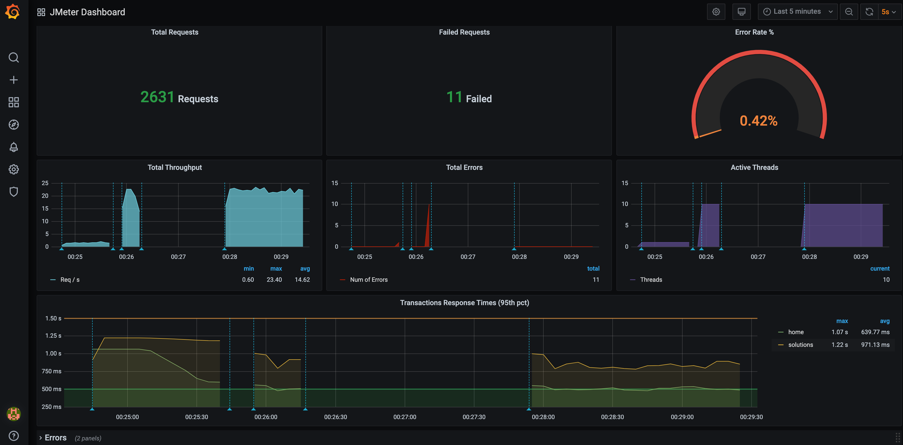

# User guide

Here we share some tips and examples on how to use the DSL to tackle common use cases.

Provided examples use [JUnit 5](https://junit.org/junit5/) and [AssertJ](https://joel-costigliola.github.io/assertj/assertj-core-quick-start.html), but you can use other test & assertion libraries.

Explore the DSL in your preferred IDE to discover all available features, and consider reviewing [existing tests](../../jmeter-java-dsl/src/test/java/us/abstracta/jmeter/javadsl) for additional examples.

The DSL currently supports most common used cases, keeping it simple and avoiding investing development effort in features that might not be needed. If you identify any particular scenario (or JMeter feature) that you need and is not currently supported, or easy to use, **please let us know by [creating an issue](https://github.com/abstracta/jmeter-java-dsl/issues)** and we will try to implement it as soon as possible. Usually porting JMeter features is quite fast.

::: tip
If you like this project, **please give it a star ⭐ in [GitHub](https://github.com/abstracta/jmeter-java-dsl)!** This helps the project be more visible, gain relevance and encourages us to invest more effort in new features.
:::

For an intro to JMeter concepts and components you can check [JMeter official documentation](http://jmeter.apache.org/usermanual/get-started.html).

## Setup

To use the DSL just include it in your project:

:::: tabs type:card
::: tab Maven
```xml
<dependency>
  <groupId>us.abstracta.jmeter</groupId>
  <artifactId>jmeter-java-dsl</artifactId>
  <version>0.49.2</version>
  <scope>test</scope>
</dependency>
```
:::
::: tab Gradle
```groovy
// this is required due to JMeter open issue: https://bz.apache.org/bugzilla/show_bug.cgi?id=64465
@CacheableRule
class JmeterRule implements ComponentMetadataRule {
    void execute(ComponentMetadataContext context) {
        context.details.allVariants {
            withDependencies {
                removeAll { it.group == "org.apache.jmeter" && it.name == "bom" }
            }
        }
    }
}

dependencies {
    ...
    testImplementation 'us.abstracta.jmeter:jmeter-java-dsl:0.49.2'
    components {
        withModule("org.apache.jmeter:ApacheJMeter_core", JmeterRule)
        withModule("org.apache.jmeter:ApacheJMeter_java", JmeterRule)
        withModule("org.apache.jmeter:ApacheJMeter", JmeterRule)
        withModule("org.apache.jmeter:ApacheJMeter_http", JmeterRule)
        withModule("org.apache.jmeter:ApacheJMeter_functions", JmeterRule)
        withModule("org.apache.jmeter:ApacheJMeter_components", JmeterRule)
        withModule("org.apache.jmeter:ApacheJMeter_config", JmeterRule)
        withModule("org.apache.jmeter:jorphan", JmeterRule)
    }
}
```
:::
::::

::: tip
[Here](https://github.com/abstracta/jmeter-java-dsl-sample) is a sample project in case you want to start one from scratch.
:::

## Simple HTTP test plan

To generate HTTP requests just use provided `httpSampler`.

Following example uses 2 threads (concurrent users) which send 10 HTTP GET requests each to `http://my.service`.

Additionally, it logs collected statistics (response times, status codes, etc.) to a timestamped file (for later analysis if needed) and checks that the response time 99 percentile is less than 5 seconds.

```java
import static org.assertj.core.api.Assertions.assertThat;
import static us.abstracta.jmeter.javadsl.JmeterDsl.*;

import java.io.IOException;
import java.time.Duration;
import java.time.Instant;
import org.junit.jupiter.api.Test;
import us.abstracta.jmeter.javadsl.core.TestPlanStats;

public class PerformanceTest {

  @Test
  public void testPerformance() throws IOException {
    TestPlanStats stats = testPlan(
        threadGroup(2, 10,
            httpSampler("http://my.service")
        ),
        //this is just to log details of each request stats
        jtlWriter("test" + Instant.now().toString().replace(":", "-") + ".jtl")
    ).run();
    assertThat(stats.overall().sampleTimePercentile99()).isLessThan(Duration.ofSeconds(5));
  }

}
```

::: tip
When working with multiple samplers in a test plan, specify their names to easily check their respective statistics.
:::

::: tip
Since JMeter uses [log4j2](https://logging.apache.org/log4j/2.x/), if you want to control logging level or output, you can use something similar to this [log4j2.xml](../../jmeter-java-dsl/src/test/resources/log4j2.xml).
:::

::: tip
Keep in mind that you can use Java programming to modularize and create abstractions which allow you to build complex test plans that are still easy to read, use and maintain. [Here is an example](https://github.com/abstracta/jmeter-java-dsl/issues/26#issuecomment-953783407) of some complex abstraction built using Java features and the DSL.
:::

Check [HTTP performance testing](#http-performance-testing) for additional details while testing HTTP services.

## DSL code generation from JMX file

To ease migrating existing JMeter test plans and ease learning about DSL features, the DSL provides `jmx2dsl` (download latest version from [releases page](https://github.com/abstracta/jmeter-java-dsl/releases)) command line tool which you can use to generate DSL code from existing JMX files.

As an example:

:::: tabs type:card
::: tab Linux & Mac
```bash
jmx2dsl test-plan.jmx
```
:::
::: tab Windows
```powershell
java -jar jmx2dsl test-plan.jmx
```
:::
::::

Could generate something like following output:

```java
testPlan(
    threadGroup(2, 10,
        httpSampler("http://my.service")
    ),
    jtlWriter("test.jtl")
)
```

::: tip
Generated DSL code only currently gets you the test plan code. You should add it to a test executed by a testing framework (like JUnit, check previous examples), required imports and dependencies (check IDEs suggestions and rest of guide listed modules) and proper assertions of expected test results.
:::

::: tip
Review and try generated code before executing it as is. I.e: tune thread groups and iterations to 1 to give it a try.
:::

::: warning
`jmx2dsl` is currently a **work in progress** and it is in it's first trial versions. 

Only part of DSL supported features are currently converted, and for the ones code generation is implemented, only most common scenarios and properties are considered.

If you find any potential improvement to code generation, **please help us by creating an [issue](https://github.com/abstracta/jmeter-java-dsl/issues) or [discussion](https://github.com/abstracta/jmeter-java-dsl/discussions)** in GitHub repository.
:::

## Run test at scale

Running a load test from one machine is not always enough, since you are limited to the machine hardware capabilities. Sometimes, is necessary to run the test using a cluster of machines to be able to generate enough load for the system under test.

### BlazeMeter

By including following module as dependency:

:::: tabs type:card
::: tab Maven
```xml
<dependency>
  <groupId>us.abstracta.jmeter</groupId>
  <artifactId>jmeter-java-dsl-blazemeter</artifactId>
  <version>0.49.2</version>
  <scope>test</scope>
</dependency>
```
:::
::: tab Gradle
```groovy
testImplementation 'us.abstracta.jmeter:jmeter-java-dsl-blazemeter:0.49.2'
```
:::
::::

You can easily run a JMeter test plan at scale in [BlazeMeter](https://www.blazemeter.com/) like this:

```java
import static org.assertj.core.api.Assertions.assertThat;
import static us.abstracta.jmeter.javadsl.JmeterDsl.*;

import java.time.Duration;
import org.junit.jupiter.api.Test;
import us.abstracta.jmeter.javadsl.blazemeter.BlazeMeterEngine;
import us.abstracta.jmeter.javadsl.core.TestPlanStats;

public class PerformanceTest {

  @Test
  public void testPerformance() throws Exception {
    TestPlanStats stats = testPlan(
        // number of threads and iterations are in the end overwritten by BlazeMeter engine settings 
        threadGroup(2, 10,
            httpSampler("http://my.service")
        )
    ).runIn(new BlazeMeterEngine(System.getenv("BZ_TOKEN"))
        .testName("DSL test")
        .totalUsers(500)
        .holdFor(Duration.ofMinutes(10))
        .threadsPerEngine(100)
        .testTimeout(Duration.ofMinutes(20)));
    assertThat(stats.overall().sampleTimePercentile99()).isLessThan(Duration.ofSeconds(5));
  }

}
```
> This test is using `BZ_TOKEN`, a custom environment variable with `<KEY_ID>:<KEY_SECRET>` format, to get the BlazeMeter API authentication credentials.

Note that is as simple as [generating a BlazeMeter authentication token](https://guide.blazemeter.com/hc/en-us/articles/115002213289-BlazeMeter-API-keys-) and adding `.runIn(new BlazeMeterEngine(...))` to any existing jmeter-java-dsl test to get it running at scale in BlazeMeter.

BlazeMeter will not only allow you to run the test at scale but also provides additional features like the nice real time reporting, historic data tracking, etc. Here is an example of how a test would look like in BlazeMeter:


Check [BlazeMeterEngine](../../jmeter-java-dsl-blazemeter/src/main/java/us/abstracta/jmeter/javadsl/blazemeter/BlazeMeterEngine.java) for details on usage and available settings when running tests in BlazeMeter.

::: tip
In case you want to get debug logs for HTTP calls to BlazeMeter API, you can include following setting to an existing `log4j2.xml` configuration file:
```xml
<Logger name="us.abstracta.jmeter.javadsl.blazemeter.BlazeMeterClient" level="DEBUG"/>
<Logger name="okhttp3" level="DEBUG"/>
```
:::

::: warning
If you use JSR223 Pre- or Post- processors with Java code (lambdas) instead of strings ([here](#change-sample-result-statuses-with-custom-logic) are some examples), or use one of the HTTP Sampler methods which receive a function as parameter (as in [here](#provide-request-parameters-programmatically-per-request)), then BlazeMeter execution won't work. You can migrate them to use `jsrPreProcessor` with string scripts instead. Check associated methods documentation for more details.
:::

### JMeter Remote Testing

JMeter already provides means to run a test on several machines controlled by one master/client machine. This is refered as [Remote Testing](http://jmeter.apache.org/usermanual/remote-test.html).

JMeter remote testing requires to setup nodes in server/slave mode (using `bin/jmeter-server` JMeter script) with a configured keystore (usually `rmi_keystore.jks`, generated with `bin/` JMeter script) which will execute a test plan triggered in a client/master node.

You can trigger such tests with the DSL using `DistributedJmeterEngine` as in following example:

```java
import static org.assertj.core.api.Assertions.assertThat;
import static us.abstracta.jmeter.javadsl.JmeterDsl.*;

import java.time.Duration;
import org.junit.jupiter.api.Test;
import us.abstracta.jmeter.javadsl.core.engines.DistributedJmeterEngine;
import us.abstracta.jmeter.javadsl.core.TestPlanStats;

public class PerformanceTest {

  @Test
  public void testPerformance() throws Exception {
    TestPlanStats stats = testPlan(
        threadGroup(200, Duration.ofMinutes(10),
            httpSampler("http://my.service")
        )
    ).runIn(new DistributedJmeterEngine("host1", "host2"));
    assertThat(stats.overall().sampleTimePercentile99()).isLessThan(Duration.ofSeconds(5));
  }

}
```

This will run 200 users for 10 minutes on each server/slave (`host1` and `host2`) and aggregate all the results in returned stats.

::: warning
To be able to run the test you require the `rmi_keystore.jks` file in working directory of the test. For the time being we couldn't find a way to allow setting any arbitrary path for the file.
:::

::: warning
In general, prefer using BlazeMeter option which avoids all the setup and maintenance costs of the infrastructure required by JMeter remote testing, in addition to additional useful features (like reporting capabilities).
:::

Check [DistributedJmeterEngine](../../jmeter-java-dsl/src/main/java/us/abstracta/jmeter/javadsl/core/engines/DistributedJmeterEngine.java) and [JMeter documentation](http://jmeter.apache.org/usermanual/remote-test.html) for proper setup and additional options.

## Advanced threads configuration

jmeter-java-dsl provides two simple ways of creating thread groups which are used in most scenarios:

* specifying threads and number of iterations each thread should execute before ending test plan
* specifying threads and duration for which each thread should execute before test plan ends

This is how they look in code:

```java
threadGroup(10, 20) // 10 threads for 20 iterations each
threadGroup(10, Duration.ofSeconds(20)) // 10 threads for 20 seconds each
```

But these options are not good when working with many threads or when trying to configure some complex test scenarios (like when doing incremental or peak tests).

### Thread ramps and holds

When working with many threads, it is advisable to configure a ramp up period, to avoid starting all threads at once affecting performance metrics and generation.

You can easily configure a ramp up with the DSL like this:

```java
threadGroup().rampTo(10, Duration.ofSeconds(5)).holdIterating(20) // ramp to 10 threads for 5 seconds (1 thread every half second) and iterating each thread 20 times
threadGroup().rampToAndHold(10, Duration.ofSeconds(5), Duration.ofSeconds(20)) //similar as above but after ramping up holding execution for 20 seconds
```

Additionally, you can use and combine these same methods to configure more complex scenarios (incremental, peak, and any other types of tests) like the following one:

```java
threadGroup()
    .rampToAndHold(10, Duration.ofSeconds(5), Duration.ofSeconds(20))
    .rampToAndHold(100, Duration.ofSeconds(10), Duration.ofSeconds(30))
    .rampTo(200, Duration.ofSeconds(10))
    .rampToAndHold(100, Duration.ofSeconds(10), Duration.ofSeconds(30))
    .rampTo(0, Duration.ofSeconds(5))
    .children(
      httpSampler("http://my.service")
    )
```

Which would translate in the following threads' timeline:


Check [DslThreadGroup](../../jmeter-java-dsl/src/main/java/us/abstracta/jmeter/javadsl/core/threadgroups/DslThreadGroup.java) for more details.

::: tip
To visualize threads timeline, for complex thread group configurations like previous one, you can get a chart like previous one by using provided `DslThreadGroup.showTimeline()` method.
:::

::: tip
If you are a JMeter GUI user, you may even be interested in using provided `TestElement.showInGui()` method, which shows the JMeter test element GUI that could help you understand what will DSL execute in JMeter. You can use this method with any test element generated by the DSL (not just thread groups).

For example, for above test plan you would get a window like the following one:


:::

::: tip
When using multiple thread groups in a test plan, consider setting a name on them to properly identify associated requests in statistics & jtl results.
:::

### Throughput based thread group

Sometimes you want to focus just on the number of requests per second to generate and don't want to be concerned about how many concurrent threads/users, and pauses between requests, are needed. For these scenarios you can use `rpsThreadGroup` like in following example:

```java
rpsThreadGroup()
    .maxThreads(500)
    .rampTo(20, Duration.ofSeconds(10))
    .rampTo(10, Duration.ofSeconds(10))
    .rampToAndHold(1000, Duration.ofSeconds(5), Duration.ofSeconds(10))
    .children(
      httpSampler("http://my.service")
    )
```

This will internally use JMeter [Concurrency Thread Group](https://jmeter-plugins.org/wiki/ConcurrencyThreadGroup/) element in combination with [Throughput Shaping Time](https://jmeter-plugins.org/wiki/ThroughputShapingTimer/).

::: tip
`rpsThreadGroup` will dynamically create and remove threads and add delays between requests to match the traffic to the expected RPS. You can also specify to control iterations per second (number of times the flow in the thread group runs per second) instead of threads by using `.counting(RpsThreadGroup.EventType.ITERATIONS)`.
:::

::: warning
RPS values control how often to adjust threads and waits. Avoid too low (eg: under 1) values which can cause big waits and don't match expected RPS.

JMeter Throughput Shaping Timer calculates each time the delay to be used not taking into consideration future expected RPS.
For instance, if you configure 1 thread with ramp from 0.01 to 10 RPS with 10 seconds duration, when 1 request is sent it will calculate that to
match 0.01 RPS has to wait `requestsCount/expectedRPS = 1/0.01 = 100` seconds, which would keep the thread stuck for 100 seconds when in fact should have done two additional requests after waiting 1 second (to match the ramp).
Setting this value greater or equal to 1 will assure at least 1 evaluation every second.
:::

::: warning
When no `maxThreads` are specified, `rpsThreadGroup` will use as many threads as needed. In such scenarios, you might end with unexpected number of threads with associated CPU and Memory requirements, which may affect the performance test metrics. **You should always set maximum threads to use** to avoid such scenarios.

You can use following formula to calculate a value for `maxThreads`: `T*R`, being `T` the maximum RPS that you want to achieve and `R` the maximum expected response time (or iteration time if you use `.counting(RpsThreadGroup.EventType.ITERATIONS)`) in seconds.
:::

::: tip
As with default thread group, with `rpsThreadGroup` you can use `showTimeline` to get a chart of configured RPS profile for easy visualization. An example chart:


:::

Check [RpsThreadGroup](../../jmeter-java-dsl/src/main/java/us/abstracta/jmeter/javadsl/core/threadgroups/RpsThreadGroup.java) for more details.

### Set Up & Tear Down

When you need to run some custom logic before or after a test plan, the simplest approach is just adding plain java code to it, or using your test framework (eg: JUnit) provided features for this purpose. Eg:

```java
import static org.assertj.core.api.Assertions.assertThat;
import static us.abstracta.jmeter.javadsl.JmeterDsl.*;

import java.io.IOException;
import java.time.Duration;
import org.junit.jupiter.api.Test;
import org.junit.jupiter.api.BeforeEach;
import org.junit.jupiter.api.AfterEach;
import us.abstracta.jmeter.javadsl.core.TestPlanStats;

public class PerformanceTest {

  @BeforeEach
  public void setup() {
    // my custom setup logic
  }

  @AfterEach
  public void setup() {
    // my custom setup logic
  }

  @Test
  public void testPerformance() throws IOException {
    TestPlanStats stats = testPlan(
        threadGroup(2, 10,
            httpSampler("http://my.service")
        )
    ).run();
    assertThat(stats.overall().sampleTimePercentile99()).isLessThan(Duration.ofSeconds(5));
  }

}
```

But, in some cases you may need the logic to run inside the JMeter execution context (eg: set some JMeter properties), or, when test plan runs at scale, to run in same host where the test plan runs (for example to use some common file).

In such scenarios you can use provided `setupThreadGroup` & `teardownThreadGroup` like in following example:

```java
import static org.assertj.core.api.Assertions.assertThat;
import static us.abstracta.jmeter.javadsl.JmeterDsl.*;

import java.io.IOException;
import java.time.Duration;
import org.apache.jmeter.protocol.http.util.HTTPConstants;
import org.junit.jupiter.api.Test;
import us.abstracta.jmeter.javadsl.core.TestPlanStats;

public class PerformanceTest {

  @Test
  public void testPerformance() throws IOException {
    TestPlanStats stats = testPlan(
        setupThreadGroup(
            httpSampler("http://my.service/tokens")
                .method(HTTPConstants.POST)
                .children(
                    jsr223PostProcessor("props.put('MY_TEST_TOKEN', prev.responseDataAsString)")
                )
        ),
        threadGroup(2, 10,
            httpSampler("http://my.service/products")
                .header("X-MY-TOKEN", "${__P(MY_TEST_TOKEN)}")
        ),
        teardownThreadGroup(
            httpSampler("http://my.service/tokens/${__P(MY_TEST_TOKEN)}")
                .method(HTTPConstants.DELETE)
        )
    ).run();
    assertThat(stats.overall().sampleTimePercentile99()).isLessThan(Duration.ofSeconds(5));
  }

}
```

::: tip
By default, JMeter automatically executes teardown thread groups when a test plan stops due to unscheduled event like sample error when stop test is configured in thread group, invocation of `ctx.getEngine().askThreadsToStop()` in jsr223 element, etc. You can disable this behavior by using testPlan `tearDownOnlyAfterMainThreadsDone` method, which might be helpful if teardown
thread group has only to run on clean test plan completion.
:::

Check [DslSetupThreadGroup](../../jmeter-java-dsl/src/main/java/us/abstracta/jmeter/javadsl/core/threadgroups/DslSetupThreadGroup.java) and [DslTeardownThreadGroup](../../jmeter-java-dsl/src/main/java/us/abstracta/jmeter/javadsl/core/threadgroups/DslTeardownThreadGroup.java) for additional tips and details on the usage of these components.

### Thread groups order

By default, when you add multiple thread groups to a test plan, JMeter will run them all in parallel. This is a very helpful behavior in many cases, but in some others you may want to run then sequentially (one after the other). To achieve this you can just use `sequentialThreadGroups()` test plan method.

## Test plan debugging

A usual requirement while building a test plan is to be able to debug for potential issues in configuration or behavior of service under test. With jmeter-java-dsl you have several options for this purpose.

### View Results Tree

One option is using provided `resultsTreeVisualizer()` like in following example:

```java
import static us.abstracta.jmeter.javadsl.JmeterDsl.*;

import java.io.IOException;
import org.junit.jupiter.api.Test;

public class PerformanceTest {

  @Test
  public void testPerformance() throws IOException {
    testPlan(
        threadGroup(1, 1,
            httpSampler("http://my.service")
        ),
        resultsTreeVisualizer()
    ).run();
  }

}
```

This will display the JMeter built-in View Results Tree element, which allows you to review request and response contents in addition to collected metrics (spent time, sent & received bytes, etc.) for each request sent to server, in a window like this one:


::: tip
To debug test plans use few iterations and threads to reduce the execution time and ease tracing by having less information to analyze.
:::

::: tip
When adding `resultsTreeVisualizer()` as child of a thread group, it will only display sample results of that thread group. When added as child of a sampler, it will only show sample results for that sampler. You can use this to only review certain sample results in your test plan.
:::

::: tip
**Remove `resultsTreeVisualizer()` from test plans when are no longer needed** (when debugging is finished). Leaving them might interfere with unattended test plan execution due to test plan execution not finishing until all visualizers windows are closed.
:::

::: warning
By default, View Results Tree only display last 500 sample results. If you need to display more elements, use provided `resultsLimit(int)` method which allows changing this value. Take into consideration that the more results are shown, the more memory that will require. So use this setting with care.
:::

### Post processor breakpoints

Another alternative is using IDE builtin debugger by adding a `jsr223PostProcessor` with java code and adding a breakpoint to the post processor code. This does not only allow checking sample result information but also JMeter variables and properties values and sampler properties.

Here is an example screenshot using this approach while debugging with an IDE:


::: tip
DSL provides following methods to ease results and variables visualization and debugging: `varsMap()`, `prevMap()`, `prevMetadata()`, `prevMetrics()`, `prevRequest()`, `prevResponse()`. Check [PostProcessorVars](../../jmeter-java-dsl/src/main/java/us/abstracta/jmeter/javadsl/core/postprocessors/DslJsr223PostProcessor.java) and [Jsr223ScriptVars](../../jmeter-java-dsl/src/main/java/us/abstracta/jmeter/javadsl/core/DslJsr223TestElement.java) for more details.
:::

::: tip
Remove such post processors when no longer needed (when debugging is finished). Leaving them would generate errors when loading generated JMX test plan or running test plan in BlazeMeter, in addition to unnecessary processing time and resource usage.  
:::

### Debug info during test plan execution

Another option, which allows collecting debugging information during a test plan execution without affecting test plan execution (doesn't stop test plan on each breakpoint as IDE debugger does, which will affect test plan collected metrics) and allows analyzing information after test plan execution, is using `debugPostProcessor` which adds a sub result to sampler results including debug information.

Here is an example that collects JMeter variables that can be reviewed with included `resultsTreeVisualizer`:

```java
import static us.abstracta.jmeter.javadsl.JmeterDsl.*;

import java.io.IOException;
import org.junit.jupiter.api.Test;

public class PerformanceTest {

  @Test
  public void testPerformance() throws IOException {
    String userIdVarName = "USER_ID";
    String usersPath = "/users";
    testPlan(
        httpDefaults().url("http://my.service"),
        threadGroup(1, 1,
            httpSampler(usersPath)
                .children(
                    jsonExtractor(userIdVarName, "[].id"),
                    debugPostProcessor()
                ),
            httpSampler(usersPath + "/${" + userIdVarName + "}")
        ),
        resultsTreeVisualizer()
    ).run();
  }

}
```

This approach is particularly helpful when debugging extractors, allowing to see what JMeter variables were or not generated by previous extractors.

In general, prefer using [Post processor with IDE debugger breakpoint](#post-processor-breakpoints) in initial stages of test plan development, testing with just 1 thread in thread groups, and use this later approach when trying to debug issues that are reproducible only in multiple threads executions or in particular environment that requires offline analysis (analyze collected information after test plan execution).

::: tip
Use this element in combination with `resultsTreeVisualizer` to review live executions, or use `jtlWriter` with `withAllFields(true)` or `saveAsXml(true)` and `saveResponseData(true)` to generate a jtl file for later analysis.
:::

::: tip
By default, `debugPostProcessor` will only include JMeter variables in generated sub sampler, which covers the most used case and keeps memory and disk usage low. `debugPostProcessor` includes additional methods that allow including other information like sampler properties, JMeter properties and system properties. Check [DslDebugPostProcessor](../../jmeter-java-dsl/src/main/java/us/abstracta/jmeter/javadsl/core/postprocessors/DslDebugPostProcessor.java) for more details.
:::

### Debug JMeter code

You can even add break points to JMeter code in your IDE and debug the code line by line providing the greatest possible detail.

Here is an example screenshot debugging HTTP Sampler:


::: tip
JMeter class in charge of executing threads logic is `org.apache.jmeter.threads.JMeterThread`. You can check classes used by each DSL provided test element by checking the DSL code.
:::

### Debug Groovy code

In some cases you may want to debug some Groovy script used in some sampler, pre- or post-processor. For such scenarios you can check [here](https://github.com/abstracta/jmeter-java-dsl/issues/41#issuecomment-966715062) where we list some options.

### Dummy Sampler

In many cases you want to be able to test different part of the test plans but without directly interacting with the service under test, avoiding any potential traffic to the servers, testing some border cases which might be difficult to reproduce with the actual server and avoid actual server interactions variability and potential unpredictability. In such scenarios, you might replace actual samplers with `dummySampler` (which uses [Dummy Sampler plugin](https://jmeter-plugins.org/wiki/DummySampler/)) to be able to test extractors, assertions, controllers conditions and other parts of the test plan under certain conditions/results generated by the samplers.

Here is an example:

```java
import static us.abstracta.jmeter.javadsl.JmeterDsl.*;

import java.io.IOException;
import org.junit.jupiter.api.Test;

public class PerformanceTest {

  @Test
  public void testPerformance() throws IOException {
    String usersIdVarName = "USER_IDS";
    String userIdVarName = "USER_ID";
    String usersPath = "/users";
    testPlan(
        httpDefaults().url("http://my.service"),
        threadGroup(1, 1,
            // httpSampler(usersPath)
            dummySampler("[{\"id\": 1, \"name\": \"John\"}, {\"id\": 2, \"name\": \"Jane\"}]")
                .children(
                    jsonExtractor(usersIdVarName, "[].id")
                        .matchNumber(-1)
                ),
            forEachController(usersIdVarName, userIdVarName,
                // httpSampler(usersPath + "/${" + userIdVarName + "}")
                dummySampler("{\"name\": \"John or Jane\"}")
                    .url("http://my.service/" + usersPath + "/${" + userIdVarName + "}")
            )
        ),
        resultsTreeVisualizer()
    ).run();
  }

}
```

::: tip
The DSL configures dummy samplers by default, in contrast to what JMeter does, with response time simulation disabled. This allows to speed up the debugging process, not having to await for proper response time simulation (sleeps/waits). If you want a more accurate emulation, you might turn it on through `responseTimeSimulation()` method.
:::

Check [DslDummySampler](../../jmeter-java-dsl/src/main/java/us/abstracta/jmeter/javadsl/core/samplers/DslDummySampler.java) for more information o additional configuration and options.

### Test plan review un JMeter GUI

A usual requirement for new DSL users that are used to Jmeter GUI, is to be able to review Jmeter DSL generated test plan in the familiar JMeter GUI. For this, you can use `showInGui()` method in test plan to open JMeter GUI with preloaded test plan. 

This can be also used to debug the test plan, by adding elements (like view results tree, dummy samplers, debug post processors, etc) in the GUI and running the test plan.

Here is a simple example using the method:

```java
import static us.abstracta.jmeter.javadsl.JmeterDsl.*;

import java.io.IOException;
import org.junit.jupiter.api.Test;

public class PerformanceTest {

  @Test
  public void testPerformance() throws IOException {
    testPlan(
        threadGroup(2, 10,
            httpSampler("http://my.service")
        )
    ).showInGui();
  }

}
```

Which ends up opening a window like this one:


## Reporting

Once you have a test plan you would usually want to be able to analyze collected information. In this section we show you several ways to achieve this.

### Log requests and responses

The main mechanism provided by JMeter (and jmeter-java-dsl) to get information about generated requests, responses and associated metrics is through the generation of JTL files.

This can be easily achieved in jmeter-java-dsl by using provided `jtlWriter` like in this example:

```java
import static org.assertj.core.api.Assertions.assertThat;
import static us.abstracta.jmeter.javadsl.JmeterDsl.*;

import java.io.IOException;
import java.time.Duration;
import java.time.Instant;
import org.junit.jupiter.api.Test;
import us.abstracta.jmeter.javadsl.core.TestPlanStats;

public class PerformanceTest {

  @Test
  public void testPerformance() throws IOException {
    TestPlanStats stats = testPlan(
        threadGroup(2, 10,
            httpSampler("http://my.service")
        ),
        jtlWriter("test" + Instant.now().toString().replace(":", "-") + ".jtl")
    ).run();
    assertThat(stats.overall().sampleTimePercentile99()).isLessThan(Duration.ofSeconds(5));
  }

}
```

By default, `jtlWriter` will write most used information to evaluate performance of tested service. If you want to trace all the information of each request you may use `jtlWriter` with `withAllFields(true)` option. Doing this will provide all the information at the cost of additional computation and resources usage (less resources for actual load testing). You can tune which fields to include or not with `jtlWriter` and only log what you need, check [JtlWriter](../../jmeter-java-dsl/src/main/java/us/abstracta/jmeter/javadsl/core/listeners/JtlWriter.java) for more details.

An additional option, specially targeted towards logging sample responses, is `responseFileSaver` which automatically generates a file for each received response. Here is an example:

```java
import static org.assertj.core.api.Assertions.assertThat;
import static us.abstracta.jmeter.javadsl.JmeterDsl.*;

import java.io.IOException;
import java.time.Duration;
import java.time.Instant;
import org.junit.jupiter.api.Test;
import us.abstracta.jmeter.javadsl.core.TestPlanStats;

public class PerformanceTest {

  @Test
  public void testPerformance() throws IOException {
    TestPlanStats stats = testPlan(
        threadGroup(2, 10,
            httpSampler("http://my.service")
        ),
        responseFileSaver(Instant.now().toString().replace(":", "-") + "-response")
    ).run();
    assertThat(stats.overall().sampleTimePercentile99()).isLessThan(Duration.ofSeconds(5));
  }

}
```

Check [ResponseFileSaver](../../jmeter-java-dsl/src/main/java/us/abstracta/jmeter/javadsl/core/listeners/ResponseFileSaver.java) for more details.

Finally, if you have more specific needs that are not covered by previous examples, you can use `jsr223PostProcessor` to define you own custom logic like this:

```java
import static org.assertj.core.api.Assertions.assertThat;
import static us.abstracta.jmeter.javadsl.JmeterDsl.*;

import java.io.IOException;
import java.time.Duration;
import java.time.Instant;
import org.junit.jupiter.api.Test;
import us.abstracta.jmeter.javadsl.core.TestPlanStats;

public class PerformanceTest {

  @Test
  public void testPerformance() throws IOException {
    TestPlanStats stats = testPlan(
        threadGroup(2, 10,
            httpSampler("http://my.service")
                .children(jsr223PostProcessor(
                    "new File('traceFile') << \"${prev.sampleLabel}>>${prev.responseDataAsString}\\n\""))
        )
    ).run();
    assertThat(stats.overall().sampleTimePercentile99()).isLessThan(Duration.ofSeconds(5));
  }

}
```

Check [DslJsr223PostProcessor](../../jmeter-java-dsl/src/main/java/us/abstracta/jmeter/javadsl/core/postprocessors/DslJsr223PostProcessor.java) for more details.

### Real-time metrics visualization and historic data storage

When running tests with JMeter (and in particular with jmeter-java-dsl) a usual requirement is to be able to store such test runs in a persistent database to later on review such metrics, and compare different test runs. Additionally, jmeter-java-dsl only provides some summary data of test run in the console while it is running, but, since it doesn't provide any sort of UI, doesn't allow to easily analyze such information as it can be done in JMeter GUI.

To overcome these limitations you can use provided support for publishing JMeter test run metrics to [InfluxDB](https://www.influxdata.com/products/influxdb-overview/) or [Elasticsearch](https://www.elastic.co/what-is/elasticsearch), which allows keeping record of all run statistics and, through [Grafana](https://grafana.com/), get some nice dashboards like the following one:



#### InfluxDB

This can be easily done using `influxDbListener`, an existing InfluxDB & Grafana server and using a dashboard like [this one](https://grafana.com/grafana/dashboards/4026).

Here is an example test plan:

```java
import static org.assertj.core.api.Assertions.assertThat;
import static us.abstracta.jmeter.javadsl.JmeterDsl.*;

import java.io.IOException;
import java.time.Duration;
import org.junit.jupiter.api.Test;
import us.abstracta.jmeter.javadsl.core.TestPlanStats;

public class PerformanceTest {

  @Test
  public void testPerformance() throws IOException {
    TestPlanStats stats = testPlan(
        threadGroup(2, 10,
            httpSampler("http://my.service")
        ),
        influxDbListener("http://localhost:8086/write?db=jmeter")
    ).run();
    assertThat(stats.overall().sampleTimePercentile99()).isLessThan(Duration.ofSeconds(5));
  }

}
```

If you want to try it locally you can run `docker-compose up` (previously [installing Docker](https://docs.docker.com/get-docker/) in you machine) inside [this directory](../../docs/guide/influxdb). After containers are started, you can open Grafana at [http://localhost:3000](http://localhost:3000). Finally, run a performance test using the `influxDbListener` and you will be able to see the live results, and keep historic data. Cool, isn't it?!

::: warning
Use provided `docker-compose` settings for local tests only. It uses weak credentials and is not properly configured for production purposes.
:::

Check [InfluxDbBackendListener](../../jmeter-java-dsl/src/main/java/us/abstracta/jmeter/javadsl/core/listeners/InfluxDbBackendListener.java) for additional details and settings.

#### Elasticsearch

Another alternative is using provided `jmeter-java-dsl-elasticsearch-listener` module with Elasticsearch and Grafana servers using a dashboard like [this one](../../docs/guide/elasticsearch/grafana-provisioning/dashboards/jmeter.json).

To use the module, you will need to include following dependency in your project:

:::: tabs type:card
::: tab Maven
```xml
<dependency>
  <groupId>us.abstracta.jmeter</groupId>
  <artifactId>jmeter-java-dsl-elasticsearch-listener</artifactId>
  <version>0.49.2</version>
  <scope>test</scope>
</dependency>
```
:::
::: tab Gradle
Add this repository:
```groovy
maven { url 'https://jitpack.io' }
```

And the dependency:
```groovy
testImplementation 'us.abstracta.jmeter:jmeter-java-dsl-elasticsearch-listener:0.49.2'
```

:::
::::

And use provided `elasticsearchListener()` method like in this example:

```java
import static org.assertj.core.api.Assertions.assertThat;
import static us.abstracta.jmeter.javadsl.JmeterDsl.*;
import static us.abstracta.jmeter.javadsl.elasticsearch.listener.ElasticsearchBackendListener.*;

import java.io.IOException;
import java.time.Duration;
import org.junit.jupiter.api.Test;
import us.abstracta.jmeter.javadsl.core.TestPlanStats;

public class PerformanceTest {

  @Test
  public void testPerformance() throws IOException {
    TestPlanStats stats = testPlan(
        threadGroup(2, 10,
            httpSampler("http://my.service")
        ),
        elasticsearchListener("http://localhost:9200/jmeter")
    ).run();
    assertThat(stats.overall().sampleTimePercentile99()).isLessThan(Duration.ofSeconds(5));
  }

}
```

::: warning
This module uses [this JMeter plugin](https://github.com/delirius325/jmeter-elasticsearch-backend-listener) which, at its current version, has performance and dependency issues which might affect your project. [This](https://github.com/delirius325/jmeter-elasticsearch-backend-listener/pull/109) and [this](https://github.com/delirius325/jmeter-elasticsearch-backend-listener/pull/110) pull requests fix those issues, but until they are merged and released, you might face such issues.    
:::

In same fashion as InfluxDB, if you want to try it locally, you can run `docker-compose up` inside [this directory](../../docs/guide/elasticsearch) and follow similar steps [as described for InfluxDB](#influxdb) to visualize live metrics in Grafana.

::: warning
Use provided `docker-compose` settings for local tests only. It uses weak or no credentials and is not properly configured for production purposes.
:::

Check [ElasticsearchBackendListener](../../jmeter-java-dsl-elasticsearch-listener/src/main/java/us/abstracta/jmeter/javadsl/elasticsearch/listener/ElasticsearchBackendListener.java) for additional details and settings.

### Generate HTML reports from test plan execution

After running a test plan you would usually like to visualize the results in friendly way that eases analysis of collected information.

One, and preferred way, to do that is through [previously mentioned alternative](#real-time-metrics-visualization-and-historic-data-storage).

Another way, might just be using [previously introduced](#simple-http-test-plan) `jtlWriter` and then loading the jtl file in JMeter GUI with one of JMeter provided listeners (like view results tree, summary report, etc.).

Another alternative is generating a standalone report for the test plan execution using jmeter-java-dsl provided `htmlReporter` like this:

```java
import static org.assertj.core.api.Assertions.assertThat;
import static us.abstracta.jmeter.javadsl.JmeterDsl.*;

import java.io.IOException;
import java.time.Duration;
import java.time.Instant;
import org.junit.jupiter.api.Test;
import us.abstracta.jmeter.javadsl.core.TestPlanStats;

public class PerformanceTest {

  @Test
  public void testPerformance() throws IOException {
    TestPlanStats stats = testPlan(
        threadGroup(2, 10,
            httpSampler("http://my.service")
        ),
        htmlReporter("html-report-" + Instant.now().toString().replace(":", "-"))
    ).run();
    assertThat(stats.overall().sampleTimePercentile99()).isLessThan(Duration.ofSeconds(5));
  }

}
```

::: warning
`htmlReporter` will throw an exception if provided directory path is a nonempty directory or file
:::

### Live built-in graphs and stats

Sometimes you want to get live statistics on the test plan and don't want to install additional tools, and are not concerned about keeping historic data.

You can use `dashboardVisualizer` to get live charts and stats for quick review.

To use it, you need to add following dependency:

:::: tabs type:card
::: tab Maven
```xml
<dependency>
  <groupId>us.abstracta.jmeter</groupId>
  <artifactId>jmeter-java-dsl-dashboard</artifactId>
  <version>0.49.2</version>
  <scope>test</scope>
</dependency>
```
:::
::: tab Gradle
```groovy
testImplementation 'us.abstracta.jmeter:jmeter-java-dsl-dashboard:0.49.2'
```
:::
::::

And use it as you would with any of previously mentioned listeners (like `influxDbListener` and `jtlWriter`).

Here is an example:

```java
import static org.assertj.core.api.Assertions.assertThat;
import static us.abstracta.jmeter.javadsl.JmeterDsl.*;
import static us.abstracta.jmeter.javadsl.dashboard.DashboardVisualizer.*;

import java.io.IOException;
import java.time.Duration;
import org.junit.jupiter.api.Test;
import us.abstracta.jmeter.javadsl.core.TestPlanStats;

public class PerformanceTest {

  @Test
  public void testPerformance() throws IOException {
    TestPlanStats stats = testPlan(
        threadGroup("Group1")
            .rampToAndHold(10, Duration.ofSeconds(10), Duration.ofSeconds(10))
            .children(
                httpSampler("Sample 1", "http://my.service")
            ),
        threadGroup("Group2")
            .rampToAndHold(20, Duration.ofSeconds(10), Duration.ofSeconds(20))
            .children(
                httpSampler("Sample 2", "http://my.service/get")
            ),
        dashboardVisualizer()
    ).run();
    assertThat(stats.overall().sampleTimePercentile99()).isLessThan(Duration.ofSeconds(5));
  }

}
```

The `dashboardVisualizer` will pop up a window like the following one, which you can use to trace statistics while the test plan runs:


::: warning
The dashboard imposes additional resources (CPU & RAM) consumption on the machine generating the load test, which may affect the test plan execution and reduce the number of concurrent threads you may reach in your machine. In general, prefer using one of previously mentioned methods and use the dashboard just for local testing and quick feedback.

**Remember removing it when is no longer needed in the test plan**
:::

::: warning
The test will not end until you close all pop up windows. This allows you to see the final charts and statistics of the plan before ending the test.
:::

::: tip
As with `jtlWriter` and `influxDbListener`, you can place `dashboardVisualizer` at different levels of test plan (at test plan level, at thread group level, as child of sampler, etc.), to only capture statistics of that particular part of the test plan.
:::

## Response Processing

### Check for expected response

By default, JMeter marks any HTTP request with a fail response code (4xx or 5xx) as failed, which allows you to easily identify when some request unexpectedly fails. But in many cases this is not enough or desirable, and you need to check for response body (or some other field) to contain (or not) certain string.

This is usually accomplished in JMeter with the usage of Response Assertions, which provides an easy and fast way to verify that you get the proper response for each step of the test plan, marking the request as failure when specified condition is not met.

Here is an example on how to specify a response assertion in jmeter-java-dsl:

```java
import static org.assertj.core.api.Assertions.assertThat;
import static us.abstracta.jmeter.javadsl.JmeterDsl.*;

import java.io.IOException;
import java.time.Duration;
import org.junit.jupiter.api.Test;
import us.abstracta.jmeter.javadsl.core.TestPlanStats;

public class PerformanceTest {

  @Test
  public void testPerformance() throws IOException {
    TestPlanStats stats = testPlan(
        threadGroup(2, 10,
            httpSampler("http://my.service")
                .children(
                    responseAssertion().containsSubstrings("OK")
                )
        )
    ).run();
    assertThat(stats.overall().sampleTimePercentile99()).isLessThan(Duration.ofSeconds(5));
  }

}
```

Check [Response Assertion](../../jmeter-java-dsl/src/main/java/us/abstracta/jmeter/javadsl/core/assertions/DslResponseAssertion.java) for more details and additional options.

For more complex scenarios check [following section](#change-sample-result-statuses-with-custom-logic).

### Change sample result statuses with custom logic

Sometimes [response assertions](#check-for-expected-response) and JMeter default behavior are not enough, and custom logic is required. In such scenarios you can use `jsr223PostProcessor` as in this example where 429 status code is not considered as a fail status code:

```java
import static org.assertj.core.api.Assertions.assertThat;
import static us.abstracta.jmeter.javadsl.JmeterDsl.*;

import java.io.IOException;
import java.time.Duration;
import org.junit.jupiter.api.Test;
import us.abstracta.jmeter.javadsl.core.TestPlanStats;

public class PerformanceTest {

  @Test
  public void testPerformance() throws IOException {
    TestPlanStats stats = testPlan(
        threadGroup(2, 10,
            httpSampler("http://my.service")
                .children(
                    jsr223PostProcessor(
                        "if (prev.responseCode == '429') { prev.successful = true }")
                )
        )
    ).run();
    assertThat(stats.overall().sampleTimePercentile99()).isLessThan(Duration.ofSeconds(5));
  }

}
```

You can also use a Java lambda instead of providing Groovy script, which benefits from Java type safety & IDEs code auto-completion:

```java
jsr223PostProcessor(s -> {
    if ("429".equals(s.prev.getResponseCode())) {
      s.prev.setSuccessful(true);
    }
})
```

::: warning
Using this last approach is currently only supported when using embedded JMeter engine (no support for saving to JMX and running it in JMeter GUI, or running it with BlazeMeter).
:::

Check [DslJsr223PostProcessor](../../jmeter-java-dsl/src/main/java/us/abstracta/jmeter/javadsl/core/postprocessors/DslJsr223PostProcessor.java) for more details and additional options.

::: warning
JSR223PostProcessor is a very powerful tool, but is not the only, nor the best, alternative for many cases where JMeter already provides a better and simpler alternative. For instance, previously mentioned might be implemented with previously presented [Response Assertion](#check-for-expected-response).
:::

### Use part of a response in a following request (aka: correlation)

It is a usual requirement while creating a test plan for an application to be able to use part of a response (e.g.: a generated ID, token, etc.) in a subsequent request. This can be easily achieved using JMeter extractors and variables.

#### Regular Expression Extractor

Here is an example with jmeter-java-dsl using regular expressions:

```java
import static org.assertj.core.api.Assertions.assertThat;
import static us.abstracta.jmeter.javadsl.JmeterDsl.*;

import java.io.IOException;
import java.time.Duration;
import org.apache.http.entity.ContentType;
import org.junit.jupiter.api.Test;
import us.abstracta.jmeter.javadsl.core.TestPlanStats;

public class PerformanceTest {

  @Test
  public void testPerformance() throws IOException {
    TestPlanStats stats = testPlan(
        threadGroup(2, 10,
            httpSampler("http://my.service/accounts")
                .post("{\"name\": \"John Doe\"}", ContentType.APPLICATION_JSON)
                .children(
                    regexExtractor("ACCOUNT_ID", "\"id\":\"([^\"]+)\"")
                ),
            httpSampler("http://my.service/accounts/${ACCOUNT_ID}")
        )
    ).run();
    assertThat(stats.overall().sampleTimePercentile99()).isLessThan(Duration.ofSeconds(5));
  }

}
```

Check [DslRegexExtractor](../../jmeter-java-dsl/src/main/java/us/abstracta/jmeter/javadsl/core/postprocessors/DslRegexExtractor.java) for more details and additional options.

#### Boundary Extractors

Regular expressions are quite powerful and flexible, but also are complex and performance might not be optimal in some scenarios. When you know that desired extraction is always surrounded by some specific text that never varies, then you can use `boundaryExtractor` which is simpler and in many cases more performant:

```java
import static org.assertj.core.api.Assertions.assertThat;
import static us.abstracta.jmeter.javadsl.JmeterDsl.*;

import java.io.IOException;
import java.time.Duration;
import org.apache.http.entity.ContentType;
import org.junit.jupiter.api.Test;
import us.abstracta.jmeter.javadsl.core.TestPlanStats;

public class PerformanceTest {

  @Test
  public void testPerformance() throws IOException {
    TestPlanStats stats = testPlan(
        threadGroup(2, 10,
            httpSampler("http://my.service/accounts")
                .post("{\"name\": \"John Doe\"}", ContentType.APPLICATION_JSON)
                .children(
                    boundaryExtractor("ACCOUNT_ID", "\"id\":\"", "\"")
                ),
            httpSampler("http://my.service/accounts/${ACCOUNT_ID}")
        )
    ).run();
    assertThat(stats.overall().sampleTimePercentile99()).isLessThan(Duration.ofSeconds(5));
  }

}
```

Check [DslBoundaryExtractor](../../jmeter-java-dsl/src/main/java/us/abstracta/jmeter/javadsl/core/postprocessors/DslBoundaryExtractor.java) for more details and additional options.

#### JSON Extractor

When the response of a request is JSON, then you can use `jsonExtractor` by using [JMESPath query](https://jmespath.org/) like in following example:

```java
import static org.assertj.core.api.Assertions.assertThat;
import static us.abstracta.jmeter.javadsl.JmeterDsl.*;

import java.io.IOException;
import java.time.Duration;
import org.apache.http.entity.ContentType;
import org.junit.jupiter.api.Test;
import us.abstracta.jmeter.javadsl.core.TestPlanStats;

public class PerformanceTest {

  @Test
  public void testPerformance() throws IOException {
    TestPlanStats stats = testPlan(
        threadGroup(2, 10,
            httpSampler("http://my.service/accounts")
                .post("{\"name\": \"John Doe\"}", ContentType.APPLICATION_JSON)
                .children(
                    jsonExtractor("ACCOUNT_ID", "id")
                ),
            httpSampler("http://my.service/accounts/${ACCOUNT_ID}")
        )
    ).run();
    assertThat(stats.overall().sampleTimePercentile99()).isLessThan(Duration.ofSeconds(5));
  }

}
```

::: warning
Be aware that this element uses JMeter JSON JMESPath Extractor element, and not the JMeter JSON Extractor element. This means that uses JMESPath instead of JSON Path.
:::

## Requests generation

### Conditionals

At some point, you will need to execute part of a test plan according to certain condition (eg: a value extracted from previous request). When you reach such point, you can use `ifController` like in following example:

```java
import static org.assertj.core.api.Assertions.assertThat;
import static us.abstracta.jmeter.javadsl.JmeterDsl.*;

import java.io.IOException;
import java.time.Duration;
import org.apache.http.entity.ContentType;
import org.junit.jupiter.api.Test;
import us.abstracta.jmeter.javadsl.core.TestPlanStats;

public class PerformanceTest {

  @Test
  public void testPerformance() throws IOException {
    TestPlanStats stats = testPlan(
        threadGroup(2, 10,
            httpSampler("http://my.service/accounts")
                .post("{\"name\": \"John Doe\"}", ContentType.APPLICATION_JSON)
                .children(
                    regexExtractor("ACCOUNT_ID", "\"id\":\"([^\"]+)\"")
                ),
            ifController("${__groovy(vars['ACCOUNT_ID'] != null)}",
                httpSampler("http://my.service/accounts/${ACCOUNT_ID}")
            )
        )
    ).run();
    assertThat(stats.overall().sampleTimePercentile99()).isLessThan(Duration.ofSeconds(5));
  }

}
```

You can also use a Java lambda instead of providing JMeter expression, which benefits from Java type safety & IDEs code auto-completion:

```java
ifController(s -> s.vars.get("ACCOUNT_ID") != null,
    httpSampler("http://my.service/accounts/${ACCOUNT_ID}")
)
```

::: warning
Using java code (lambdas) will only work with embedded JMeter engine (no support for saving to JMX and running it in JMeter GUI, or running it with BlazeMeter). Use the first option to avoid such limitations.
:::

Check [DslIfController](../../jmeter-java-dsl/src/main/java/us/abstracta/jmeter/javadsl/core/controllers/DslIfController.java) and [JMeter Component documentation](https://jmeter.apache.org/usermanual/component_reference.html#If_Controller) for more details.

### Loops

#### Iterating over extracted values

A common use case is to iterate over a list of values extracted from a previous request and execute part of the plan for each extracted value. This can be easily done using `foreachController` like in following example:

```java
package us.abstracta.jmeter.javadsl;

import static org.assertj.core.api.Assertions.assertThat;
import static us.abstracta.jmeter.javadsl.JmeterDsl.*;

import java.io.IOException;
import java.time.Duration;
import org.junit.jupiter.api.Test;
import us.abstracta.jmeter.javadsl.core.TestPlanStats;

public class PerformanceTest {

  @Test
  public void testPerformance() throws IOException {
    String productsIdVarName = "PRODUCT_IDS";
    String productIdVarName = "PRODUCT_ID";
    String productsPath = "/products";
    TestPlanStats stats = testPlan(
        httpDefaults().url("http://my.service"),
        threadGroup(2, 10,
            httpSampler(productsPath)
                .children(
                    jsonExtractor(productsIdVarName, "[].id")
                        .matchNumber(-1)
                ),
            forEachController(productsIdVarName, productIdVarName,
                httpSampler(productsPath + "/${" + productIdVarName + "}")
            )
        )
    ).run();
    assertThat(stats.overall().sampleTimePercentile99()).isLessThan(Duration.ofSeconds(5));
  }

}
```

::: tip
JMeter automatically generates a variable `__jm__<loopName>__idx` with the current index of for each iteration (starting with 0), which you can use in controller children elements if needed. Default name for for each controller, when not specified, is `foreach`.
:::

Check [DslForEachController](../../jmeter-java-dsl/src/main/java/us/abstracta/jmeter/javadsl/core/controllers/DslForEachController.java) for more details.

#### While Controller

If at any time you want to execute a given part of a test plan, inside a thread iteration, while a condition is met, then you can use `whileController` (internally using [JMeter While Controller](https://jmeter.apache.org/usermanual/component_reference.html#While_Controller)) like in following example:

```java
import static org.assertj.core.api.Assertions.assertThat;
import static us.abstracta.jmeter.javadsl.JmeterDsl.*;

import java.io.IOException;
import java.time.Duration;
import org.apache.http.entity.ContentType;
import org.junit.jupiter.api.Test;
import us.abstracta.jmeter.javadsl.core.TestPlanStats;

public class PerformanceTest {

  @Test
  public void testPerformance() throws IOException {
    TestPlanStats stats = testPlan(
        threadGroup(2, 10,
            whileController("${__groovy(vars['ACCOUNT_ID'] == null)}",
                httpSampler("http://my.service/accounts")
                    .post("{\"name\": \"John Doe\"}", ContentType.APPLICATION_JSON)
                    .children(
                        regexExtractor("ACCOUNT_ID", "\"id\":\"([^\"]+)\"")
                    )
            )
        )
    ).run();
    assertThat(stats.overall().sampleTimePercentile99()).isLessThan(Duration.ofSeconds(5));
  }

}
```

As with `ifController`, you can also use Java lambdas to benefit from IDE auto-completion and type safety. Eg:

```java
whileController(s -> s.vars.get("ACCOUNT_ID") == null,
    httpSampler("http://my.service/accounts")
      .post("{\"name\": \"John Doe\"}", Type.APPLICATION_JSON)
      .children(
        regexExtractor("ACCOUNT_ID", "\"id\":\"([^\"]+)\"")
      )
)
```

::: warning
Using java code (lambdas) will only work with embedded JMeter engine (no support for saving to JMX and running it in JMeter GUI, or running it with BlazeMeter). Use the first option to avoid such limitations.
:::

::: warning
JMeter evaluates while conditions before entering each iteration, and after exiting each iteration. Take this into consideration if the condition has side effects (eg: incrementing counters, altering some other state, etc).
:::

::: tip
JMeter automatically generates a variable `__jm__<loopName>__idx` with the current index of while iteration (starting with 0). Example:

```java
whileController("items", "${__groovy(vars.getObject('__jm__items__idx') < 4)}",
    httpSampler("http://my.service/items")
      .post("{\"name\": \"My Item\"}", Type.APPLICATION_JSON)
)
```

Default name for while controller, when not specified, is `while`.
:::

Check [DslWhileController](../../jmeter-java-dsl/src/main/java/us/abstracta/jmeter/javadsl/core/controllers/DslWhileController.java) for more details.

#### For Loop Controller

In simple scenarios where you just want to execute a fixed number of times, within a thread group iteration, a given part of the test plan, you can just use `forLoopController` (which uses [JMeter Loop Controller component](https://jmeter.apache.org/usermanual/component_reference.html#Loop_Controller)) as in following example:

```java
import static org.assertj.core.api.Assertions.assertThat;
import static us.abstracta.jmeter.javadsl.JmeterDsl.*;

import java.io.IOException;
import java.time.Duration;
import org.junit.jupiter.api.Test;
import us.abstracta.jmeter.javadsl.core.TestPlanStats;

public class PerformanceTest {

  @Test
  public void testPerformance() throws IOException {
    TestPlanStats stats = testPlan(
        threadGroup(2, 10,
            forLoopController(5,
                httpSampler("http://my.service/accounts")
            )
        )
    ).run();
    assertThat(stats.overall().sampleTimePercentile99()).isLessThan(Duration.ofSeconds(5));
  }

}
```

This will result in 10 * 5 = 50 requests to the given URL for each thread in the thread group.

::: tip
JMeter automatically generates a variable `__jm__<loopName>__idx` with the current index of for loop iteration (starting with 0) which you can use in children elements. Default name for for loop controller, when not specified, is `for`.
:::

Check [ForLoopController](../../jmeter-java-dsl/src/main/java/us/abstracta/jmeter/javadsl/core/controllers/ForLoopController.java) for more details.

#### Once Only Controller

In some cases, you only need to run part of a test plan once. For these needs you can use `onceOnlyController`. This controller will execute a part of test plan only one time on first iteration (using [JMeter Once Only Controller Component](https://jmeter.apache.org/usermanual/component_reference.html#Once_Only_Controller)).

You can use this, for example, for one-time authorization or for setting JMeter variables or properties.

Here is an example:

```java
import static us.abstracta.jmeter.javadsl.JmeterDsl.*;

import org.apache.jmeter.protocol.http.util.HTTPConstants;
import org.junit.jupiter.api.Test;
import us.abstracta.jmeter.javadsl.JmeterDslTest;

public class DslOnceOnlyControllerTest extends JmeterDslTest {

  @Test
  public void shouldExecuteOnlyOneTimeWhenOnceOnlyControllerInPlan() throws Exception {
    testPlan(
        threadGroup(1, 10,
            onceOnlyController(
                httpSampler("http://my.service/login") // only runs once
                    .method(HTTPConstants.POST)
                    .header("Authorization", "Basic asdf=")
                    .children(
                        regexExtractor("AUTH_TOKEN", "authToken=(.*)")
                    )
            ),
            httpSampler("http://my.service/accounts") // runs ten times
                .header("Authorization", "Bearer ${AUTH_TOKEN}")
        )
    ).run();
  }

}
```

Check [DslOnceOnlyController](../../jmeter-java-dsl/src/main/java/us/abstracta/jmeter/javadsl/core/controllers/DslOnceOnlyController.java) for more details.

### Provide Request Parameters Programmatically per Request

With the standard DSL you can provide static values to request parameters, such as a body. However, you may also want to be able to modify your requests for each call. This is common in cases where your request creates something that must have unique values.

```java
import static org.assertj.core.api.Assertions.assertThat;
import static us.abstracta.jmeter.javadsl.JmeterDsl.*;

import java.io.IOException;
import java.time.Duration;
import org.apache.jmeter.threads.JMeterVariables;
import org.apache.http.entity.ContentType;
import org.junit.jupiter.api.Test;
import us.abstracta.jmeter.javadsl.core.TestPlanStats;

public class PerformanceTest {

  @Test
  public void testPerformance() throws IOException {
    TestPlanStats stats = testPlan(
        threadGroup(2, 10,
            httpSampler("http://my.service")
                .post("${REQUEST_BODY}", ContentType.TEXT_PLAIN)
                .children(
                    jsr223PreProcessor("vars.put('REQUEST_BODY', " + getClass().getName()
                        + ".buildRequestBody(vars))")
                )
        )
    ).run();
    assertThat(stats.overall().sampleTimePercentile99()).isLessThan(Duration.ofSeconds(5));
  }

  public static String buildRequestBody(JMeterVariables vars) {
    String countVarName = "REQUEST_COUNT";
    Integer countVar = (Integer) vars.getObject(countVarName);
    int count = countVar != null ? countVar + 1 : 1;
    vars.putObject(countVarName, count);
    return "MyBody" + count;
  }

}
```

You can also use a Java lambda instead of providing Groovy script, which benefits from Java type safety & IDEs code auto-completion:

```java
jsr223PreProcessor(s -> s.vars.put("REQUEST_BODY", buildRequestBody(s.vars)))
```

Or even use this shorthand:

```java
post(s -> buildRequestBody(s.vars), Type.TEXT_PLAIN)
```

::: warning
Using java code (lambdas) will only work with embedded JMeter engine (no support for saving to JMX and running it in JMeter GUI, or running it with BlazeMeter). Use the first option to avoid such limitations.
:::

Check [DslJsr223PreProcessor](../../jmeter-java-dsl/src/main/java/us/abstracta/jmeter/javadsl/core/preprocessors/DslJsr223PreProcessor.java) & [DslHttpSampler](../../jmeter-java-dsl/src/main/java/us/abstracta/jmeter/javadsl/http/DslHttpSampler.java) for more details and additional options.

### CSV as input data for requests

Sometimes is necessary to run same flow but using different but pre-defined data on each request. For example, a common use case is using a different user (from a given set) in each request.

This can be easily achieved using provided `csvDataSet` element. For example, having a file like this one:

```csv
USER,PASS
user1,pass1
user2,pass2
```

You can implement a test plan which test recurrent login with the two users with something like this:

```java
import static org.assertj.core.api.Assertions.assertThat;
import static us.abstracta.jmeter.javadsl.JmeterDsl.*;

import java.io.IOException;
import java.time.Duration;
import org.apache.jmeter.protocol.http.util.HTTPConstants;
import org.apache.http.entity.ContentType;
import org.junit.jupiter.api.Test;
import us.abstracta.jmeter.javadsl.core.TestPlanStats;

public class PerformanceTest {

  @Test
  public void testPerformance() throws IOException {
    TestPlanStats stats = testPlan(
        csvDataSet("users.csv"),
        threadGroup(5, 10,
            httpSampler("http://my.service/login")
                .post("{\"${USER}\": \"${PASS}\"", ContentType.APPLICATION_JSON),
            httpSampler("http://my.service/logout")
                .method(HTTPConstants.POST)
        )
    ).run();
    assertThat(stats.overall().sampleTimePercentile99()).isLessThan(Duration.ofSeconds(5));
  }

}
```

::: tip
By default the CSV file will be opened once and shared by all threads. This means that when one thread reads a CSV line in one iteration, then the following thread reading a line will continue for the following line.

If you want to change this (to only share file per thread group, or using one file per thread), then you can use provided sharedIn method like in followin example:

```java
import us.abstracta.jmeter.javadsl.core.configs.DslCsvDataSet.Sharing;
...
  TestPlanStats stats = testPlan(
      csvDataSet("users.csv")
        .sharedIn(Sharing.THREAD),
      threadGroup(5, 10,
          httpSampler("http://my.service/login")
            .post("{\"${USER}\": \"${PASS}\"", Type.APPLICATION_JSON),
          httpSampler("http://my.service/logout")
            .method(HTTPConstants.POST)
      )
  )
```
:::

::: warning
You can use `randomOrder()` method to get CSV lines in random order (using [Random CSV Data Set plugin](https://github.com/Blazemeter/jmeter-bzm-plugins/blob/master/random-csv-data-set/RandomCSVDataSetConfig.md)), but this is less performant as getting them sequentially, so use it sparingly.
:::

Check [DslCsvDataSet](../../jmeter-java-dsl/src/main/java/us/abstracta/jmeter/javadsl/core/configs/DslCsvDataSet.java) for additional details and options (like changing delimiter, handling files without headers line, stopping on end of file, etc.).

### Group requests

Sometimes, is necessary to be able to group requests which constitute different steps in a test. For example, to separate necessary requests to do a login from the ones used to add items to the cart and the ones to do a purchase. JMeter (and the DSL) provide Transaction Controllers for this purpose, here is an example:

```java
import static us.abstracta.jmeter.javadsl.JmeterDsl.*;

import java.io.IOException;
import org.apache.http.entity.ContentType;
import org.junit.jupiter.api.Test;

public class SaveTestPlanAsJMX {

  @Test
  public void testTransactions() throws IOException {
    testPlan(
        threadGroup(2, 10,
            transaction('login',
                httpSampler("http://my.service"),
                httpSampler("http://my.service/login")
                    .post("user=test&password=test", ContentType.APPLICATION_FORM_URLENCODED)
            ),
            transaction('addItemToCart',
                httpSampler("http://my.service/items"),
                httpSampler("http://my.service/cart/items")
                    .post("{\"id\": 1}", ContentType.APPLICATION_JSON)
            )
        )
    ).run();
  }

}
```

This will provide additional sample results for each transaction, which contain the aggregate metrics for containing requests, allowing to focus on the actual flow steps instead of each particular request.

### Emulate user delays between requests

Sometimes, is necessary to replicate users' behavior on the test plan, adding a timer between requests is one of the most used practices. For example, simulate the time it will take to complete a purchase form. JMeter (and the DSL) provide Uniform Random Timer for this purpose. Here is an example that adds a delay between four and ten seconds:

```java
import static us.abstracta.jmeter.javadsl.JmeterDsl.*;

import java.io.IOException;
import org.apache.http.entity.ContentType;
import org.junit.jupiter.api.Test;

public class PerformanceTest {

  @Test
  public void testTransactions() throws IOException {
    testPlan(
        threadGroup(2, 10,
            transaction('addItemToCart',
                httpSampler("http://my.service/items"),
                httpSampler("http://my.service/cart/items")
                    .post("{\"id\": 1}", ContentType.APPLICATION_JSON)
            ),
            transaction('chekcout',
                httpSampler("http://my.service/cart/chekout"),
                uniformRandomTimer(4000, 10000),
                httpSampler("http://my.service/cart/checkout/userinfo")
                    .post(
                        "{\"Name\": Dave, \"lastname\": Tester, \"Street\": 1483  Smith Road, \"City\": Atlanta}",
                        ContentType.APPLICATION_JSON)
            )
        )
    ).run();
  }

}
```

::: warning
Timers apply to all samplers in their scope, adding a pause after pre-processors executions and before the actual sampling. For example, in previous example pauses would be added before checkout and also before user info (two pauses).

If you want to apply a timer only to one sampler, add it as child of the given sampler. Like in this example:

```java
httpSampler("http://my.service/cart/chekout")
    .children(uniformRandomTimer(4000, 10000))
```
:::

::: warning
`uniformRandomTimer` `minimumMillis` and `maximumMillis` parameters differ from the ones used by JMeter Uniform Random Timer element, to make it simpler to users with no JMeter background.

The generated JMeter test element uses as `Constant Delay Offset` the `minimumMillis` value, and as `Maximum random delay` `(maximumMillis - minimumMillis)` value.
:::

### Execute test plan part for a fraction of times

In some cases, you may want to execute a given part of the test plan not in every iteration and only for a given percent of the times to emulate certain probabilistic nature of the flow the users execute.

In such scenarios you may use `percentController`, which uses JMeter Throughput Controller to achieve exactly that.

Here is an example:

```java
import static org.assertj.core.api.Assertions.assertThat;
import static us.abstracta.jmeter.javadsl.JmeterDsl.*;

import java.time.Duration;
import org.junit.jupiter.api.Test;
import us.abstracta.jmeter.javadsl.core.TestPlanStats;

public class PerformanceTest {

  @Test
  public void testPerformance() throws Exception {
    TestPlanStats stats = testPlan(
        threadGroup(2, 10,
            percentController(40, // run this 40% of the times
                httpSampler("http://my.service/status"),
                httpSampler("http://my.service/poll")),
            percentController(70, // run this 70% of the times
                httpSampler("http://my.service/items"))
        )
    ).run();
    assertThat(stats.overall().sampleTimePercentile99()).isLessThan(Duration.ofSeconds(5));
  }

}
```

Check [PercentController](../../jmeter-java-dsl/src/main/java/us/abstracta/jmeter/javadsl/core/controllers/PercentController.java) for more details.

### Parallel requests

JMeter provides two main ways for running requests in parallel: thread groups and http samplers downloading embedded resources in parallel. But in some cases is necessary to run requests in parallel which can't be properly modeled with previously mentioned scenarios. For such cases you can use `paralleController` which allows using the [Parallel Controller plugin](https://github.com/Blazemeter/jmeter-bzm-plugins/blob/master/parallel/Parallel.md) to execute a given set of requests in parallel (while in a JMeter thread iteration step).

To use it, add following dependency to your project:

:::: tabs type:card
::: tab Maven
```xml
<dependency>
  <groupId>us.abstracta.jmeter</groupId>
  <artifactId>jmeter-java-dsl-parallel</artifactId>
  <version>0.49.2</version>
  <scope>test</scope>
</dependency>
```
:::
::: tab Gradle
```groovy
testImplementation 'us.abstracta.jmeter:jmeter-java-dsl-dashboard:0.49.2'
```
:::
::::

And use it like in following example:

```java
import static org.assertj.core.api.Assertions.assertThat;
import static us.abstracta.jmeter.javadsl.JmeterDsl.*;
import static us.abstracta.jmeter.javadsl.parallel.ParallelController.*;

import java.time.Duration;
import org.junit.jupiter.api.Test;
import us.abstracta.jmeter.javadsl.core.TestPlanStats;

public class PerformanceTest {

  @Test
  public void testPerformance() throws Exception {
    TestPlanStats stats = testPlan(
        threadGroup(2, 10,
            parallelController(
                httpSampler("http://my.service/status"),
                httpSampler("http://my.service/poll"))
        )
    ).run();
    assertThat(stats.overall().sampleTimePercentile99()).isLessThan(Duration.ofSeconds(5));
  }

}
```

::: tip
By default the controller has no limit on the number of parallel requests per JMeter thread. You can set a limit by using provided `maxThreads(int)` method. Additionally, you can opt to aggregate children results in a parent sampler using `generateParentSample(boolean)` method, in similar fashion to transaction controller.
:::

::: tip
When requesting embedded resources of an HTML response, prefer using `downloadEmbeddedResources(boolean)` method in `httpSampler` instead. Likewise, when you just need independent parts of a test plan to execute in parallel, prefer using different thread group for each part.
:::

Check [ParallelController](../../jmeter-java-dsl-parallel/src/main/java/us/abstracta/jmeter/javadsl/parallel/ParallelController.java) for additional info.

## JMeter variables & properties

### Variables

In general, when you want to reuse a certain value of your script, you can use, and is the preferred way, just to use Java variables. In some cases though, you might need to pre initialize some JMeter thread variable (for example to later be used in an `ifController`) or easily update its value without having to use a jsr223 element for that. For these cases the DSL provides the `vars()` method. 

Here is an example:

```java
import static us.abstracta.jmeter.javadsl.JmeterDsl.*;

import org.junit.jupiter.api.Test;

public class PerformanceTest {

  @Test
  public void testPerformance() throws Exception {
    String pageVarName = "PAGE";
    String firstPage = "1";
    String endPage = "END";
    testPlan(
        vars()
            .set(pageVarName, firstPage),
        threadGroup(2, 10,
            ifController(s -> !s.vars.get(pageVarName).equals(endPage),
                httpSampler("http://my.service/accounts?page=${" + pageVarName +"}")
                    .children(
                        regexExtractor(pageVarName, "next=.*?page=(\\d+)")
                            .defaultValue(endPage)
                    )
            ),
            ifController(s -> s.vars.get(pageVarName).equals(endPage),
                vars()
                    .set(pageVarName, firstPage)
            )
        )
    ).run();
  }

}
```

::: warning
For special consideration of existing JMeter users:

`vars()` internally uses JMeter User Defined Variables (aka UDV) when placed as test plan child, but a JSR223 sampler otherwise. This decision avoids several non-intuitive behaviors of JMeter UDV which are listed in red blocks in [the JMeter component documentation](https://jmeter.apache.org/usermanual/component_reference.html#User_Defined_Variables). 

Internally using a JSR223 sampler, allows DSL users to properly scope a variable to where it is placed (eg: defining a variable in one thread has no effect on other threads or thread groups), set the value when actually needed (not just at the beginning of test plan execution), and support cross-variable references (i.e.: if `var1=test` and `var2=${var1}`, then value of `var2` would be solved to `test`).

When `vars()` is located as direct child of the test plan, due to usage of UDV, declared variables will be available to all thread groups and no variable cross-reference is supported.
:::

Check [DslVariables](../../jmeter-java-dsl/src/main/java/us/abstracta/jmeter/javadsl/core/configs/DslVariables.java) for more details.

### Properties

You might reach a point where you want to pass some parameter to test plan or want to share some object or data that is available for all threads to use. In such scenarios you can use JMeter properties.

JMeter properties are basically a map of keys and values, that is accessible to all threads. To access them you can use `${__P(PROPERTY_NAME)}` or equivalent `${__property(PROPERTY_NAME)` inside almost any string, `props['PROPERTY_NAME']` inside groovy scripts or `props.get("PROPERTY_NAME")` in lambda expressions.

To set them, you can use `prop()` method included in `EmbeddedJmeterEngine` like in following example:

```java
import static us.abstracta.jmeter.javadsl.JmeterDsl.*;

import org.junit.jupiter.api.Test;
import us.abstracta.jmeter.javadsl.core.engines.EmbeddedJmeterEngine;

public class PerformanceTest {

  @Test
  public void testProperties() {
    testPlan(
        threadGroup(1, 1,
            httpSampler("http://myservice.test/${__P(MY_PROP)}")
        )
    ).runIn(new EmbeddedJmeterEngine()
        .prop("MY_PROP", "MY_VAL"));
  }

}
```

Or you can set them in groovy or java code, like in following example:

```java
import static us.abstracta.jmeter.javadsl.JmeterDsl.*;

import org.junit.jupiter.api.Test;

public class PerformanceTest {

  @Test
  public void testProperties() {
    testPlan(
        threadGroup(1, 1,
            jsr223Sampler("props.put('MY_PROP', 'MY_VAL')"),
            httpSampler("http://myservice.test/${__P(MY_PROP)}")
        )
    ).run();
  }

}
```

::: tip
You can put any object (not just strings) in properties, but only strings can be accessed via `${__P(PROPERTY_NAME)}` and `${__property(PROPERTY_NAME)}`.

Being able to put any kind of object allows you to do very powerful stuff, like implementing a custom cache, or injecting some custom logic to test plan.
:::

::: tip
You can also specify properties though JVM system properties either by setting JVM parameter `-D` or using `System.setProperty()` method.

When properties are set as JVM system properties, they are not accessible via `props[PROPERTY_NAME]` or `props.get("PROPERTY_NAME")`. If you need to access them from groovy or java code, then use `props.getProperty("PROPERTY_NAME")` instead.
:::

::: warning
JMeter properties can currently only be used with `EmbeddedJmeterEngine`, so use them sparingly and prefer other mechanisms when available.
:::

## Protocols

### HTTP performance testing

Throughout this guide, several examples have been shown for simple cases of HTTP requests (mainly how to do gets and posts), but the DSL provides additional features that you might need to be aware.

Here we show some of them, but check [JmeterDsl](../../jmeter-java-dsl/src/main/java/us/abstracta/jmeter/javadsl/JmeterDsl.java) and [DslHttpSampler](../../jmeter-java-dsl/src/main/java/us/abstracta/jmeter/javadsl/http/DslHttpSampler.java) to explore all available features.

#### Methods & body

As previously seen you can do simple gets and post like in following snippet:

```java
httpSampler("http://my.service") // A simple get
httpSampler("http://my.service")
    .post("{\"field\":\"val\"}", Type.APPLICATION_JSON) // simple post
```

But you can also use additional methods to specify any HTTP method and body:

```java
httpSampler("http://my.service")
  .method(HTTPConstants.PUT)
  .contentType(Type.APPLICATION_JSON)
  .body("{\"field\":\"val\"}")
```

When in need to generate dynamic URLs or bodies you can use a lambda expressions (as previously seen in some example):

```java
httpSampler("http://my.service")
  .post(s -> buildRequestBody(s.vars), Type.TEXT_PLAIN)
httpSampler("http://my.service")
  .body(s -> buildRequestBody(s.vars))
httpSampler(s -> buildRequestUrl(s.vars))
```

::: warning
As previously mentioned for other lambdas, using them will only work with embedded JMeter engine. So, prefer using [JSR223 pre processors](#provide-request-parameters-programmatically-per-request) with groovy script instead if you want to be able to run the test at scale or use generated JMX.
:::

#### Parameters

In many cases you will need to specify some URL query string parameters or URL encoded form bodies. For these cases, you can use `param` method as in following example:

```java
import static us.abstracta.jmeter.javadsl.JmeterDsl.*;

import org.apache.jmeter.protocol.http.util.HTTPConstants;
import org.junit.jupiter.api.Test;

public class PerformanceTest {

  @Test
  public void test() throws Exception {
    String baseUrl = "https://myservice.com/products";
    testPlan(
        threadGroup(1, 1,
            // GET https://myservice.com/products?name=iron+chair
            httpSampler("GetIronChair", baseUrl) 
                .param("name", "iron chair"),
            /*
             * POST https://myservice.com/products
             * Content-Type: application/x-www-form-urlencoded
             * 
             * name=wooden+chair
             */
            httpSampler("CreateWoodenChair", baseUrl)
                .method(HTTPConstants.POST) // POST 
                .param("name", "wooden chair")
            )
    ).run();
  }

}
```

::: tip
JMeter automatically URL encodes parameters, so you don't need to worry about special characters in parameters names or values. 

If you want to use some custom encoding or have an already encoded value that you want to use, then you can use `encodedParam` method instead which does not apply any encoding to parameter name or value and send it as they is.
:::

#### Headers

You might have already noticed in some of the examples that we have shown already some ways to set some headers. For instance, in following snippet `Content-Type` header is being set in two different ways:

```java
httpSampler("http://my.service")
  .post("{\"field\":\"val\"}", Type.APPLICATION_JSON)
httpSampler("http://my.service")
  .contentType(Type.APPLICATION_JSON)
```

These are handy methods to specify `Content-Type` header, but you can also set any header on a particular request using provided `header` method, like this:

```java
httpSampler("http://my.service")
  .header("X-First-Header", "val1")
  .header("X-Second-Header", "val2")
```

Additionally, you can specify headers to be used by all samplers in a test plan, thread group, transaction controllers, etc. For this you can use `httpHeaders` like this:

```java
testPlan(
    threadGroup(2, 10,
        httpHeaders()
          .header("X-Header", "val1"),
        httpSampler("http://my.service"),
        httpSampler("http://my.service/users")
    )
).run();
```

::: tip
You can also use lambda expressions for dynamically building HTTP Headers, but same limitations apply as in other cases (running in BlazeMeter or using generated JMX file).
:::

#### Multipart requests

When you need to upload files to an HTTP server or need to send a complex request body, you will in many cases require sending multipart requests. To send a multipart request just use `bodyPart` and `bodyFilePart` methods like in following example:

```java
import static us.abstracta.jmeter.javadsl.JmeterDsl.*;

import org.apache.http.entity.ContentType;
import org.apache.jmeter.protocol.http.util.HTTPConstants;
import org.junit.jupiter.api.Test;

public class PerformanceTest {

  @Test
  public void test() throws Exception {
    testPlan(
        threadGroup(1, 1,
            httpSampler("https://myservice.com/report")
                .method(HTTPConstants.POST)
                .bodyPart("myText", "Hello World", ContentType.TEXT_PLAIN)
                .bodyFilePart("myFile", "myReport.xml", ContentType.TEXT_XML)
        )
    ).run();
  }

}
```

#### Cookies & Caching

jmeter-java-dsl automatically adds a cookie manager and cache manager for automatic HTTP cookie and caching handling, emulating browsers behavior. If you need to disable them you can use something like this:

```java
testPlan(
    httpCookies().disable(),
    httpCache().disable(),
    threadGroup(2, 10,
        httpSampler("http://my.service")
    )
)
```

#### Embedded resources

Sometimes you may need to reproduce browsers behavior, downloading for a given URL all associated resources (images, frames, etc.).

jmeter-java-dsl allows you to easily reproduce this scenario by using the `downloadEmbeddedResources` method in `httpSampler` like in following example:

```java
import static org.assertj.core.api.Assertions.assertThat;
import static us.abstracta.jmeter.javadsl.JmeterDsl.*;

import java.io.IOException;
import java.time.Duration;
import org.junit.jupiter.api.Test;
import us.abstracta.jmeter.javadsl.core.TestPlanStats;

public class PerformanceTest {

  @Test
  public void testPerformance() throws IOException {
    TestPlanStats stats = testPlan(
        threadGroup(5, 10,
            httpSampler("http://my.service/")
                .downloadEmbeddedResources()
        )
    ).run();
    assertThat(stats.overall().sampleTimePercentile99()).isLessThan(Duration.ofSeconds(5));
  }

}
```

This will make JMeter to automatically parse the HTTP response for embedded resources, download them and register embedded resources downloads as sub samples of the main sample.

Check [JMeter documentation](https://jmeter.apache.org/usermanual/component_reference.html#HTTP_Request) for additional details on downloaded embedded resources.

::: warning
The DSL, unlike JMeter, uses by default concurrent download of embedded resources (with up to 6 parallel downloads), which is the most used scenario to emulate browsers behavior.
:::

#### Redirects

When jmeter-java-dsl (using JMeter logic) detects a redirection, it will automatically do a request to the redirected URL and register the redirection as a sub sample of the main request.

If you want to disable such logic, you can just call `.followRedirects(false)` in a given `httpSampler`.

#### HTTP defaults

Whenever you need to use some repetitive value or common setting among HTTP samplers (and any part of test plan) the preferred way (due to readability, debugability, traceability and, in some cases, simplicity) is to create a Java variable or custom builder method. 

For example:

```java
import static us.abstracta.jmeter.javadsl.JmeterDsl.*;

import java.io.IOException;
import org.apache.http.entity.ContentType;
import org.junit.jupiter.api.Test;
import us.abstracta.jmeter.javadsl.http.DslHttpSampler;

public class PerformanceTest {

  @Test
  public void performanceTest() throws IOException {
    String host = "myservice.my";
    testPlan(
        threadGroup(10, 100,
            productCreatorSampler(host, "Rubber"),
            productCreatorSampler(host, "Pencil")
        )
    ).run();
  }

  private DslHttpSampler productCreatorSampler(String host, String productName) {
    return httpSampler("https://" + host + "/api/product")
        .post("{\"name\": \"" + productName + "\"}", ContentType.APPLICATION_JSON);
  }

}
```

In some cases though, it might be simpler to just use provided `httpDefaults` method, like in following example:

```java
import static us.abstracta.jmeter.javadsl.JmeterDsl.*;

import java.io.IOException;
import org.junit.jupiter.api.Test;

public class PerformanceTest {

  @Test
  public void performanceTest() throws IOException {
    testPlan(
        httpDefaults()
            .url("https://myservice.my")
            .downloadEmbeddedResources(),
        threadGroup(10, 100,
            httpSampler("/products"),
            httpSampler("/cart")
        )
    ).run();
  }

}
```

Check [DslHttpDefaults](../../jmeter-java-dsl/src/main/java/us/abstracta/jmeter/javadsl/http/DslHttpDefaults.java) for additional details on available default options.

#### Overriding URL protocol, host or port 

In some cases you might want to use a default base url but some particular requests may require some part of the url to be different (eg: protocol, host or port).

The preferred way (due to maintainability, language & IDE provided features, tracability, etc) of doing this, as with defaults, is using java code. Eg:

```java
import static us.abstracta.jmeter.javadsl.JmeterDsl.*;

import org.junit.jupiter.api.Test;

public class PerformanceTest {

  @Test
  public void test() throws Exception {
    String protocol = "https://";
    String host = "myservice.com";
    String baseUrl = protocol + host;
    testPlan(
        threadGroup(1, 1,
            httpSampler(baseUrl + "/products"),
            httpSampler(protocol + "api." + host + "/cart"),
            httpSampler(baseUrl + "/stores")
        )
    ).run();
  }

}
```

But in some cases this might be too verbose, or unnatural for users with existing JMeter knowledge. In such cases you can use provided methods (`protocol`, `host` & `port`) to just specify the part you want to modify for the sampler like in following example:

```java
import static us.abstracta.jmeter.javadsl.JmeterDsl.*;

import org.junit.jupiter.api.Test;

public class PerformanceTest {

  @Test
  public void test() throws Exception {
    testPlan(
        threadGroup(1, 1,
            httpDefaults()
                .url("https://myservice.com"),
            httpSampler("/products"),
            httpSampler("/cart")
                .host("subDomain.myservice.com"),
            httpSampler("/stores")
        )
    ).run();
  }

}
```


### JDBC and databases interactions

Several times you will need to interact with a database to either set it to a known state while setting up the test plan, cleaning it up while tearing down the test plan or even to check or generate some values in database while test plan is running.

For these use cases you can use JDBC DSL provided elements.

Including following dependency in your project:

:::: tabs type:card
::: tab Maven
```xml
<dependency>
  <groupId>us.abstracta.jmeter</groupId>
  <artifactId>jmeter-java-dsl-jdbc</artifactId>
  <version>0.49.2</version>
  <scope>test</scope>
</dependency>
```
:::
::: tab Gradle
```groovy
testImplementation 'us.abstracta.jmeter:jmeter-java-dsl-jdbc:0.49.2'
```
:::
::::

And adding proper JDBC driver for your database, like this an example for PostgreSQL:

:::: tabs type:card
::: tab Maven
```xml
<dependency>
  <groupId>org.postgresql</groupId>
  <artifactId>postgresql</artifactId>
  <version>42.3.1</version>
  <scope>test</scope>
</dependency>
```
:::
::: tab Gradle
```groovy
testImplementation 'org.postgresql:postgresql:42.3.1'
```
:::
::::

You can interact with the database like this:

```java
import static org.assertj.core.api.Assertions.assertThat;
import static us.abstracta.jmeter.javadsl.JmeterDsl.*;
import static us.abstracta.jmeter.javadsl.jdbc.JdbcJmeterDsl.*;

import java.io.IOException;
import java.sql.Types;
import java.time.Duration;
import org.apache.http.entity.ContentType;
import org.junit.jupiter.api.Test;
import org.postgresql.Driver;
import us.abstracta.jmeter.javadsl.core.TestPlanStats;
import us.abstracta.jmeter.javadsl.jdbc.DslJdbcSampler;

public class PerformanceTest {

  @Test
  public void testPerformance() throws IOException {
    String jdbcPoolName = "pgLocalPool";
    String productName = "dsltest-prod";
    DslJdbcSampler cleanUpSampler = jdbcSampler(jdbcPoolName,
        "DELETE FROM products WHERE name = '" + productName + "'")
        .timeout(Duration.ofSeconds(10));
    TestPlanStats stats = testPlan(
        jdbcConnectionPool(jdbcPoolName, Driver.class, "")
            .user("user")
            .password("pass"),
        setupThreadGroup(
            cleanUpSampler
        ),
        threadGroup(5, 10,
            httpSampler("CreateProduct", "http://my.service/products")
                .post("{\"name\", \"" + productName + "\"}", ContentType.APPLICATION_JSON),
            jdbcSampler("GetProductsIdsByName", jdbcPoolName,
                "SELECT id FROM products WHERE name=?")
                .param(productName, Types.VARCHAR)
                .vars("PRODUCT_ID")
                .timeout(Duration.ofSeconds(10)),
            httpSampler("GetLatestProduct",
                "http://my.service/products/${__V(PRODUCT_ID_${PRODUCT_ID_#})}")
        ),
        teardownThreadGroup(
            cleanUpSampler
        )
    ).run();
    assertThat(stats.overall().sampleTimePercentile99()).isLessThan(Duration.ofSeconds(5));
  }

}
```

::: tip
Always specify a query timeout to quickly identify unexpected behaviors in queries.
:::

::: tip
Don't forget proper WHERE conditions in UPDATES and DELETES, and proper indexes for table columns participating in WHERE conditions 😊.
:::

Check [JdbcJmeterDsl](../../jmeter-java-dsl-jdbc/src/main/java/us/abstracta/jmeter/javadsl/jdbc/JdbcJmeterDsl.java) for additional details and options and [JdbcJmeterDslTest](../../jmeter-java-dsl-jdbc/src/test/java/us/abstracta/jmeter/javadsl/jdbc/JdbcJmeterDslTest.java) for additional examples.

### Java API performance testing

Sometimes JMeter provided samplers are not enough for testing a particular technology, custom code or service that requires some custom code to interact with. For these cases you might use `jsr223Sampler` which allows you to use custom logic to generate a sample result.

Here is an example for load testing a redis server:

```java
import static org.assertj.core.api.Assertions.assertThat;
import static us.abstracta.jmeter.javadsl.JmeterDsl.*;

import java.io.IOException;
import java.time.Duration;
import org.junit.jupiter.api.Test;
import us.abstracta.jmeter.javadsl.core.TestPlanStats;

public class TestRedis {

  @Test
  public void shouldGetExpectedSampleResultWhenJsr223SamplerWithLambdaAndCustomResponse()
      throws IOException {
    TestPlanStats stats = testPlan(
        threadGroup(2, 10,
            jsr223Sampler("import redis.clients.jedis.Jedis\n"
                + "Jedis jedis = new Jedis('localhost', 6379)\n"
                + "jedis.connect()\n"
                + "SampleResult.connectEnd()\n"
                + "jedis.set('foo', 'bar')\n"
                + "return jedis.get(\"foo\")")
        )
    ).run();
    assertThat(stats.overall().sampleTimePercentile99()).isLessThan(Duration.ofMillis(500));
  }

}
```

::::: tip
Remember adding any particular dependencies required by your code. For example, above example requires this dependency:

:::: tabs type:card
::: tab Maven
```xml
<dependency>
  <groupId>redis.clients</groupId>
  <artifactId>jedis</artifactId>
  <version>3.6.0</version>
  <scope>test</scope>
</dependency>
```
:::
::: tab Gradle
```groovy
testImplementation 'redis.clients:jedis:3.6.0'
```
:::
::::
:::::

You can also use Java lambdas instead of Groovy script to take advantage of IDEs auto-completion and Java type safety:

```java
jsr223Sampler(v -> {
    SampleResult result = v.sampleResult;
    Jedis jedis = new Jedis("localhost", 6379);
    jedis.connect();
    result.connectEnd();
    jedis.set("foo", "bar");
    result.setResponseData(jedis.get("foo"), StandardCharsets.UTF_8.name());
})
```

::: warning
Using java code (lambdas) will only work with embedded JMeter engine (no support for saving to JMX and running it in JMeter GUI, or running it with BlazeMeter). Use the first option to avoid such limitations.
:::

`jsr223Sampler` is very powerful, but also makes code and test plan harder to maintain (as with any custom code) compared to using JMeter built-in samplers. So, in general, prefer using JMeter provided samplers if they are enough for the task at hand, and use `jsr223Sampler` sparingly.

Check [DslJsr223Sampler](../../jmeter-java-dsl/src/main/java/us/abstracta/jmeter/javadsl/java/DslJsr223Sampler.java) for more details and additional options.

## Custom or yet not supported test elements

Whenever you find some JMeter test element or feature that is not yet supported by the DSL, **we strongly encourage you to request it as an issue [here](https://github.com/abstracta/jmeter-java-dsl/issues)** or even contribute it to the DSL (check [Contributing guide](../../CONTRIBUTING.md)) so the entire community can benefit from it.

In some cases though, you might have some private custom test element that you don't want to publish or share with the rest of the community, or you are just really in a hurry and want to use it while the proper support is included in the DSL.

For such cases, the preferred approach is implementing a builder class for the test element. Eg:

```java
import org.apache.jmeter.testelement.TestElement;
import us.abstracta.jmeter.javadsl.core.samplers.BaseSampler;

public class DslCustomSampler extends DslSampler<DslCustomSampler> {

  private String myProp;

  private DslCustomSampler(String name) {
    super(name, CustomSamplerGui.class); // you can pass null here if custom sampler is a test bean
  }

  public DslCustomSampler myProp(String val) {
    this.myProp = val;
    return this;
  }

  @Override
  protected TestElement buildTestElement() {
    CustomSampler ret = new CustomSampler();
    ret.setMyProp(myProp);
    return ret;
  }

  public static DslCustomSampler customSampler(String name) {
    return new DslCustomSampler(name);
  }

}
```

Which you can use as any other JMeter DSL component, like in this example:

```java
import static us.abstracta.jmeter.javadsl.DslCustomSampler.*;
import static us.abstracta.jmeter.javadsl.JmeterDsl.*;

import org.junit.jupiter.api.Test;

public class PerformanceTest {

  @Test
  public void test() throws Exception {
    testPlan(
        threadGroup(1, 1,
            customSampler("mySampler")
                .myProp("myVal")
            )
    ).run();
  }

}
```

This approach allows for easy reuse, compact and simple usage in tests, and you might even create your own `CustomJmeterDsl` class containing builder methods for many custom components. 

Alternatively, when you want to skip creating subclasses, you might use the DSL wrapper module.

Include the module on your project:

:::: tabs type:card
::: tab Maven
```xml
<dependency>
  <groupId>us.abstracta.jmeter</groupId>
  <artifactId>jmeter-java-dsl-wrapper</artifactId>
  <version>0.49.2</version>
  <scope>test</scope>
</dependency>
```
:::
::: tab Gradle
```groovy
testImplementation 'us.abstracta.jmeter:jmeter-java-dsl-wrapper:0.49.2'
```
:::
::::

And use a wrapper like in following example:

```java
import static us.abstracta.jmeter.javadsl.JmeterDsl.*;
import static us.abstracta.jmeter.javadsl.wrapper.WrapperJmeterDsl.*;

import org.junit.jupiter.api.Test;

public class PerformanceTest {

  @Test
  public void test() throws Exception {
    testPlan(
        threadGroup(1, 1,
            testElement("mySampler", new CustomSamplerGui()) // for test beans you can just provide the test bean instance
                .prop("myProp","myVal")
            )
    ).run();
  }

}
```

Check [WrapperJmeterDsl](../../jmeter-java-dsl-wrapper/src/main/java/us/abstracta/jmeter/javadsl/wrapper/WrapperJmeterDsl.java) for more details and additional wrappers.

## JMX support

### Save as JMX

In case you want to load a test plan in JMeter GUI, you can save it just invoking `saveAsJMX` method in the test plan as in the following example:

```java
import static us.abstracta.jmeter.javadsl.JmeterDsl.*;

public class SaveTestPlanAsJMX {

  public static void main(String[] args) throws Exception {
    testPlan(
        threadGroup(2, 10,
            httpSampler("http://my.service")
        )
    ).saveAsJmx("dsl-test-plan.jmx");
  }

}
```

This can be helpful to share a Java DSL defined test plan with people not used to the DSL, or to use some JMeter feature (or plugin) that is not yet supported by the DSL (**but, we strongly encourage you to report it as an issue [here](https://github.com/abstracta/jmeter-java-dsl/issues)** so we can include such support into the DSL for the rest of the community).

::: tip
If you get any error (like `CannotResolveClassException`) while loading the JMX in JMeter GUI, you can try copying jmeter-java-dsl jar (and any other potential modules you use) to JMeter lib library, restart JMeter and try loading the JMX again.
:::

::: warning
Take into consideration that currently there is no automatic way to migrate changes done in JMX to the Java DSL.
:::

::: warning
If you use JSR223 Pre- or Post- processors with Java code (lambdas) instead of strings, or use one of the HTTP Sampler methods which receive a function as parameter, then the exported JMX will not work in JMeter GUI. You can migrate them to use jsrPreProcessor with string scripts instead.
:::

### Run JMX file

jmeter-java-dsl also provides means to easily run a test plan from a JMX file either locally or in BlazeMeter (through [previously mentioned jmeter-java-dsl-blazemeter module](#run-test-at-scale-in-blazemeter)). Here is an example:

```java
import static org.assertj.core.api.Assertions.assertThat;

import java.io.IOException;
import java.time.Duration;
import org.junit.jupiter.api.Test;
import us.abstracta.jmeter.javadsl.core.DslTestPlan;
import us.abstracta.jmeter.javadsl.core.TestPlanStats;

public class RunJmxTestPlan {

  @Test
  public void testPerformance() throws IOException {
    TestPlanStats stats = DslTestPlan.fromJmx("test-plan.jmx").run();
    assertThat(stats.overall().sampleTimePercentile99()).isLessThan(Duration.ofSeconds(5));
  }

}
``` 

This can be used to just run existing JMX files, or when DSL has no support for some JMeter functionality or plugin, and you need to use JMeter GUI to build the test plan but still want to use jmeter-java-dsl to run the test plan embedded in Java test or code.

::: tip
When the JMX uses some custom plugin or JMeter protocol support, you might need to add required dependencies to be able to run the test in an embedded engine. For example, when running a TN3270 JMX test plan using RTE plugin you will need to add the following repository and dependencies:
```xml
<repositories>
  <repository>
    <id>jitpack.io</id>
    <url>https://jitpack.io</url>
  </repository>
</repositories>

<dependencies>
  ...
  <dependency>
    <groupId>com.github.Blazemeter</groupId>
    <artifactId>RTEPlugin</artifactId>
    <version>3.1</version>
    <scope>test</scope>
  </dependency>
  <dependency>
    <groupId>com.github.Blazemeter</groupId>
    <artifactId>dm3270</artifactId>
    <version>0.12.3-lib</version>
    <scope>test</scope>
  </dependency>
</dependencies>
```
:::

