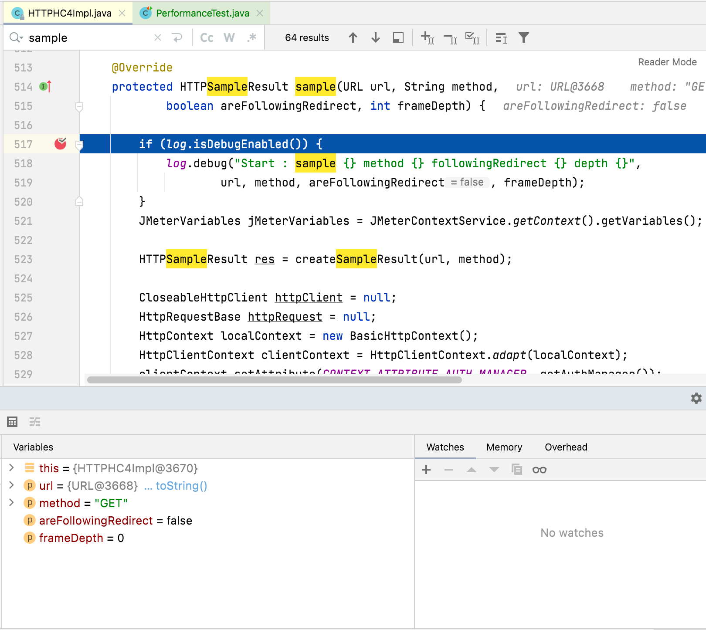

### Debug JMeter code

You can even add breakpoints to JMeter code in your IDE and debug the code line by line providing the greatest possible detail.

Here is an example screenshot debugging HTTP Sampler:

::: tip
JMeter class in charge of executing threads logic is `org.apache.jmeter.threads.JMeterThread`. You can check the classes used by each DSL-provided test element by checking the DSL code.
:::
