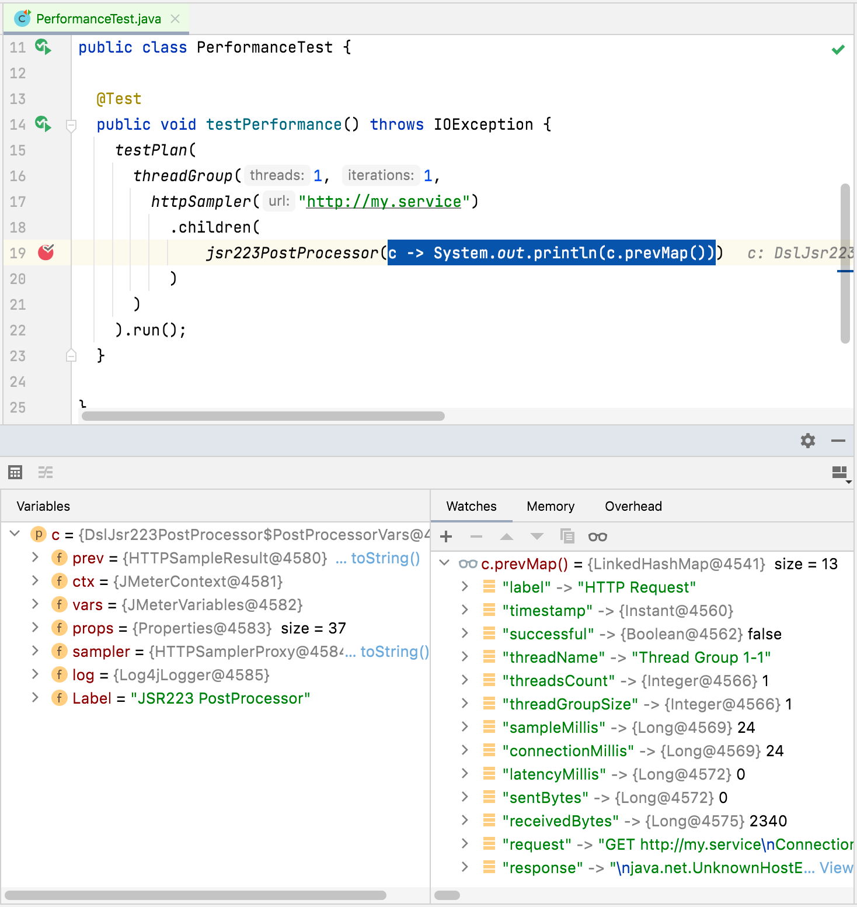

### Post-processor breakpoints

Another alternative is using IDE's built-in debugger by adding a `jsr223PostProcessor` with java code and adding a breakpoint to the post-processor code. This does not only allow checking sample result information but also JMeter variables and properties values and sampler properties.

Here is an example screenshot using this approach while debugging with an IDE:

::: tip
DSL provides following methods to ease results and variables visualization and debugging: `varsMap()`, `prevMap()`, `prevMetadata()`, `prevMetrics()`, `prevRequest()`, `prevResponse()`. Check [PostProcessorVars](/jmeter-java-dsl/src/main/java/us/abstracta/jmeter/javadsl/core/postprocessors/DslJsr223PostProcessor.java) and [Jsr223ScriptVars](/jmeter-java-dsl/src/main/java/us/abstracta/jmeter/javadsl/core/testelements/DslJsr223TestElement.java) for more details.
:::

::: tip
Remove such post processors when no longer needed (when debugging is finished). Leaving them would generate errors when loading generated JMX test plan or running the test plan in BlazeMeter, OctoPerf or Azure, in addition to unnecessary processing time and resource usage.  
:::

