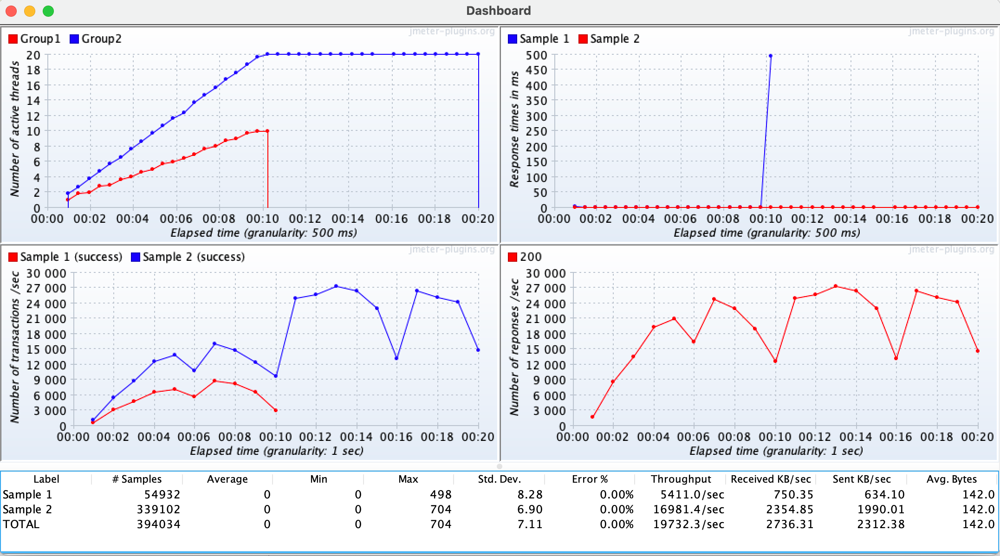

### Live built-in graphs and stats

Sometimes you want to get live statistics on the test plan and don't want to install additional tools, and are not concerned about keeping historic data.

You can use `dashboardVisualizer` to get live charts and stats for quick review.

To use it, you need to add the following dependency:

:::: code-group
::: code-group-item Maven
```xml
<dependency>
  <groupId>us.abstracta.jmeter</groupId>
  <artifactId>jmeter-java-dsl-dashboard</artifactId>
  <version>1.19</version>
  <scope>test</scope>
</dependency>
```
:::
::: code-group-item Gradle
```groovy
testImplementation 'us.abstracta.jmeter:jmeter-java-dsl-dashboard:1.19'
```
:::
::::

And use it as you would with any of the previously mentioned listeners (like `influxDbListener` and `jtlWriter`).

Here is an example:

```java
import static org.assertj.core.api.Assertions.assertThat;
import static us.abstracta.jmeter.javadsl.JmeterDsl.*;
import static us.abstracta.jmeter.javadsl.dashboard.DashboardVisualizer.*;

import java.io.IOException;
import java.time.Duration;
import org.junit.jupiter.api.Test;
import us.abstracta.jmeter.javadsl.core.TestPlanStats;

public class PerformanceTest {

  @Test
  public void testPerformance() throws IOException {
    TestPlanStats stats = testPlan(
        threadGroup("Group1")
            .rampToAndHold(10, Duration.ofSeconds(10), Duration.ofSeconds(10))
            .children(
                httpSampler("Sample 1", "http://my.service")
            ),
        threadGroup("Group2")
            .rampToAndHold(20, Duration.ofSeconds(10), Duration.ofSeconds(20))
            .children(
                httpSampler("Sample 2", "http://my.service/get")
            ),
        dashboardVisualizer()
    ).run();
    assertThat(stats.overall().sampleTimePercentile99()).isLessThan(Duration.ofSeconds(5));
  }

}
```

The `dashboardVisualizer` will pop up a window like the following one, which you can use to trace statistics while the test plan runs:



::: warning
The dashboard imposes additional resources (CPU & RAM) consumption on the machine generating the load test, which may affect the test plan execution and reduce the number of concurrent threads you may reach in your machine. In general, prefer using one of the previously mentioned methods and using the dashboard just for local testing and quick feedback.

**Remember to remove it when is no longer needed in the test plan**
:::

::: warning
The test will not end until you close all popup windows. This allows you to see the final charts and statistics of the plan before ending the test.
:::

::: tip
As with `jtlWriter` and `influxDbListener`, you can place `dashboardVisualizer` at different levels of the test plan (at the test plan level, at the thread group level, as a child of a sampler, etc.), to only capture statistics of that particular part of the test plan.
:::
