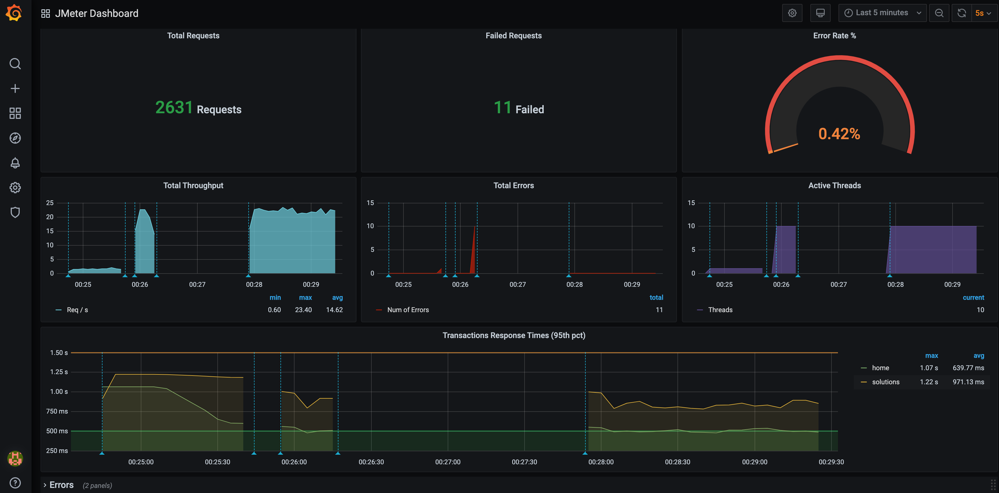

#### InfluxDB

To overcome these limitations you can use provided support for publishing JMeter test run metrics to [InfluxDB](https://www.influxdata.com/products/influxdb-overview/) or [Elasticsearch](https://www.elastic.co/what-is/elasticsearch), which allows keeping a record of all run statistics and, through [Grafana](https://grafana.com/), get some nice dashboards like the following one:



This can be easily done using `influxDbListener`, an existing InfluxDB & Grafana server, and using a dashboard like [this one](https://grafana.com/grafana/dashboards/4026).

Here is an example test plan:

```java
import static org.assertj.core.api.Assertions.assertThat;
import static us.abstracta.jmeter.javadsl.JmeterDsl.*;

import java.io.IOException;
import java.time.Duration;
import org.junit.jupiter.api.Test;
import us.abstracta.jmeter.javadsl.core.TestPlanStats;

public class PerformanceTest {

  @Test
  public void testPerformance() throws IOException {
    TestPlanStats stats = testPlan(
        threadGroup(2, 10,
            httpSampler("http://my.service")
        ),
        influxDbListener("http://localhost:8086/write?db=jmeter")
    ).run();
    assertThat(stats.overall().sampleTimePercentile99()).isLessThan(Duration.ofSeconds(5));
  }

}
```

If you want to try it locally, you can run `docker-compose up` (previously [installing Docker](https://docs.docker.com/get-docker/) in you machine) inside [this directory](/docs/guide/reporting/real-time/influxdb). After containers are started, you can open Grafana at [http://localhost:3000](http://localhost:3000). Finally, run a performance test using the `influxDbListener` and you will be able to see the live results, and keep historic data. Cool, isn't it?!

::: warning
Use provided `docker-compose` settings for local tests only. It uses weak credentials and is not properly configured for production purposes.
:::

Check [InfluxDbBackendListener](/jmeter-java-dsl/src/main/java/us/abstracta/jmeter/javadsl/core/listeners/InfluxDbBackendListener.java) for additional details and settings.
