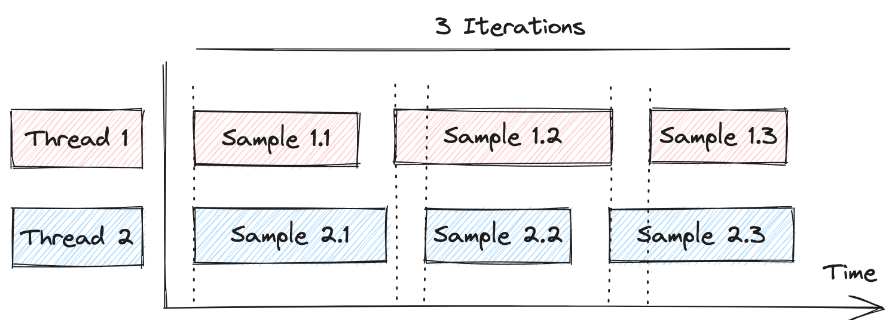
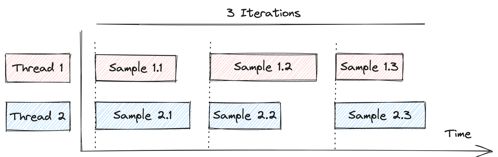

#### Requests synchronization

Usually, samples generated by different threads in a test plan thread group start deviating from each other according to the different durations each of them may experience.

Here is a diagram depicting this behavior, extracted from [this nice example](https://github.com/abstracta/jmeter-java-dsl/discussions/204) provided by one of JMeter DSL users:



In most cases this is ok. But, if you want to generate batches of simultaneous requests to a system under test, this variability will prevent you from getting the expected behavior.

So, to synchronize requests, by holding some of them until all are in sync, like in this diagram:



You can use `synchronizingTimer` like in the following example:

```java
testPlan(
    threadGroup(2, 3,
      httpSample("https://mysite"),
      synchronizingTimer()
    )
)
```
