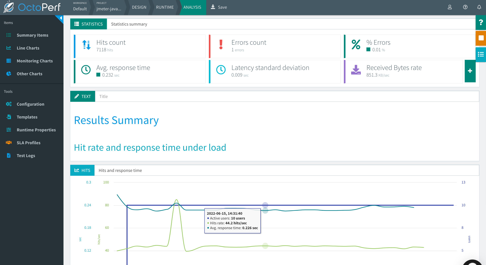

### OctoPerf

In the same fashion as with BlazeMeter, just by including the following module as a dependency:

:::: code-group type:card
::: code-group-item Maven
```xml
<dependency>
  <groupId>us.abstracta.jmeter</groupId>
  <artifactId>jmeter-java-dsl-octoperf</artifactId>
  <version>1.19</version>
  <scope>test</scope>
</dependency>
```
:::
::: code-group-item Gradle
```groovy
testImplementation 'us.abstracta.jmeter:jmeter-java-dsl-octoperf:1.19'
```
:::
::::

You can easily run a JMeter test plan at scale in [OctoPerf](https://octoperf.com/) like this:

```java
import static org.assertj.core.api.Assertions.assertThat;
import static us.abstracta.jmeter.javadsl.JmeterDsl.*;

import java.time.Duration;
import org.junit.jupiter.api.Test;
import us.abstracta.jmeter.javadsl.octoperf.OctoPerfEngine;
import us.abstracta.jmeter.javadsl.core.TestPlanStats;

public class PerformanceTest {

  @Test
  public void testPerformance() throws Exception {
    TestPlanStats stats = testPlan(
        // number of threads and iterations are in the end overwritten by OctoPerf engine settings 
        threadGroup(2, 10,
            httpSampler("http://my.service")
        )
    ).runIn(new OctoPerfEngine(System.getenv("OCTOPERF_API_KEY"))
        .projectName("DSL test")
        .totalUsers(500)
        .rampUpFor(Duration.ofMinutes(1))
        .holdFor(Duration.ofMinutes(10))
        .testTimeout(Duration.ofMinutes(20)));
    assertThat(stats.overall().sampleTimePercentile99()).isLessThan(Duration.ofSeconds(5));
  }

}
```
> This test is using `OCTOPERF_API_KEY`, a custom environment variable containing an OctoPerf API key.

Note that, as with the BlazeMeter case, it is as simple as [getting the OctoPerf API key](https://doc.octoperf.com/account/profile/#apikey) and adding `.runIn(new OctoPerfEngine(...))` to any existing jmeter-java-dsl test to get it running at scale in OctoPerf.

As with the BlazeMeter case, with OctoPerf you can not only run the test at scale but also get additional features like nice real-time reporting, historic data tracking, etc. Here is an example of how a test looks like in OctoPerf:



Check [OctoPerfEngine](/jmeter-java-dsl-octoperf/src/main/java/us/abstracta/jmeter/javadsl/octoperf/OctoPerfEngine.java) for details on usage and available settings when running tests in OctoPerf.

::: warning
To avoid piling up virtual users and scenarios in OctoPerf project, OctoPerfEngine deletes any OctoPerfEngine previously created entities (virtual users and scenarios with `jmeter-java-dsl` tag) in the project.

**It is very important that you use different project names for different projects** to avoid interference (parallel execution of two jmeter-java-dsl projects).

If you want to disable this automatic cleanup, you can use the existing OctoPerfEngine method `.projectCleanUp(false)`.
:::

::: tip
In case you want to get debug logs for HTTP calls to OctoPerf API, you can include the following setting to an existing `log4j2.xml` configuration file:
```xml
<Logger name="us.abstracta.jmeter.javadsl.octoperf.OctoPerfClient" level="DEBUG"/>
<Logger name="okhttp3" level="DEBUG"/>
```
:::

::: warning
There is currently no built-in support for test elements with Java lambdas in `OctoPerfEngine` (as there is for `BlazeMeterEngine`). If you need it, please request it by creating a [GitHub issue](https://github.com/abstracta/jmeter-java-dsl/issues).
:::

::: warning
By default the engine is configured to timeout if test execution takes more than 1 hour.
This timeout exists to avoid any potential problem with OctoPerf execution not detected by the
client, and avoid keeping the test indefinitely running until is interrupted by a user,
which is specially annoying when running tests in automated fashion, for example in CI/CD.
It is strongly advised to **set this timeout properly in each run**, according to the expected test
execution time plus some additional margin (to consider for additional delays in OctoPerf
test setup and teardown) to avoid unexpected test plan execution failure (due to timeout) or
unnecessary waits when there is some unexpected issue with OctoPerf execution.
:::

