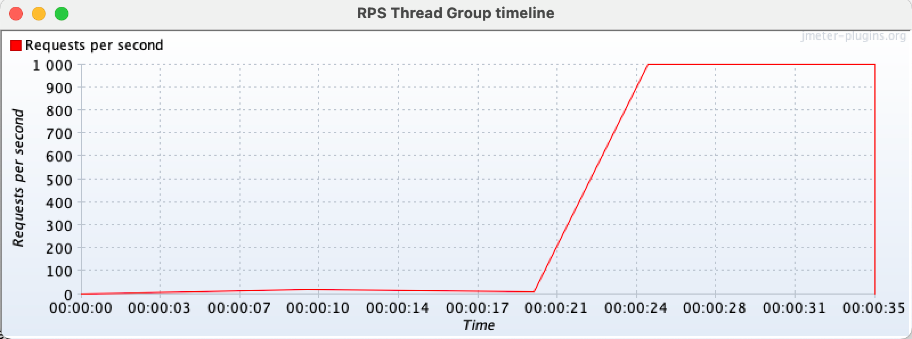

### Throughput based thread group

Sometimes you want to focus just on the number of requests per second to generate and don't want to be concerned about how many concurrent threads/users, and pauses between requests, are needed. For these scenarios you can use `rpsThreadGroup` like in the following example:

```java
rpsThreadGroup()
    .maxThreads(500)
    .rampTo(20, Duration.ofSeconds(10))
    .rampTo(10, Duration.ofSeconds(10))
    .rampToAndHold(1000, Duration.ofSeconds(5), Duration.ofSeconds(10))
    .children(
      httpSampler("http://my.service")
    )
```

This will internally use JMeter [Concurrency Thread Group](https://jmeter-plugins.org/wiki/ConcurrencyThreadGroup/) element in combination with [Throughput Shaping Time](https://jmeter-plugins.org/wiki/ThroughputShapingTimer/).

::: tip
`rpsThreadGroup` will dynamically create and remove threads and add delays between requests to match the traffic to the expected RPS. You can also specify to control iterations per second (the number of times the flow in the thread group runs per second) instead of threads by using `.counting(RpsThreadGroup.EventType.ITERATIONS)`.
:::

::: warning
RPS values control how often to adjust threads and waits. Avoid too low (eg: under 1) values which can cause big waits and don't match the expected RPS.

JMeter Throughput Shaping Timer calculates each time the delay to be used not taking into consideration future expected RPS.
For instance, if you configure 1 thread with a ramp from 0.01 to 10 RPS with 10 seconds duration, when 1 request is sent it will calculate that to
match 0.01 RPS has to wait `requestsCount/expectedRPS = 1/0.01 = 100` seconds, which would keep the thread stuck for 100 seconds when in fact should have done two additional requests after waiting 1 second (to match the ramp).
Setting this value greater or equal to 1 will assure at least 1 evaluation every second.
:::

::: warning
When no `maxThreads` are specified, `rpsThreadGroup` will use as many threads as needed. In such scenarios, you might face an unexpected number of threads with associated CPU and Memory requirements, which may affect the performance test metrics. **You should always set maximum threads to use** to avoid such scenarios.

You can use the following formula to calculate a value for `maxThreads`: `T*R`, being `T` the maximum RPS that you want to achieve and `R` the maximum expected response time (or iteration time if you use `.counting(RpsThreadGroup.EventType.ITERATIONS)`) in seconds.
:::

::: tip
As with the default thread group, with `rpsThreadGroup` you can use `showTimeline` to get a chart of configured RPS profile for easy visualization. An example chart:


:::

Check [RpsThreadGroup](/jmeter-java-dsl/src/main/java/us/abstracta/jmeter/javadsl/core/threadgroups/RpsThreadGroup.java) for more details.
