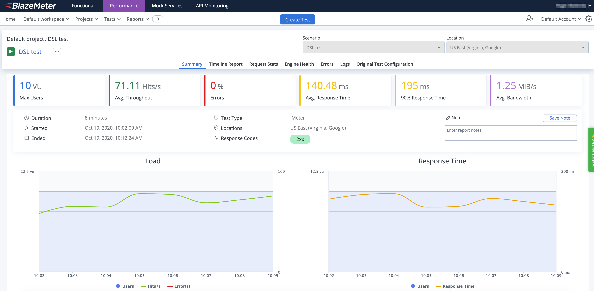

# Additional features

This document lists some use cases that might be really helpful in several cases.

## Run test at scale in [BlazeMeter](https://www.blazemeter.com/)

Running a load test from one machine is not always enough, since you are limited to the machine hardware capabilities. Sometimes, is necessary to run the test using a cluster of machines to be able to generate enough load for the system under test.

By including following module as dependency:

```xml
<dependency>
  <groupId>us.abstracta.jmeter</groupId>
  <projectId>jmeter-java-dsl-blazemeter</projectId>
  <version>0.4</version>
</dependency>
```

You can easily run a JMeter test plan at scale in BlazeMeter like this:

```java
import static org.assertj.core.api.Assertions.assertThat;
import static us.abstracta.jmeter.javadsl.JmeterDsl.*;

import java.time.Duration;
import org.junit.jupiter.api.Test;
import us.abstracta.jmeter.javadsl.blazemeter.BlazeMeterEngine;
import us.abstracta.jmeter.javadsl.core.TestPlanStats;

public class PerformanceTest {

  @Test
  public void testPerformance() throws Exception {
    TestPlanStats stats = testPlan(
      // number of threads and iterations are in the end overwritten by BlazeMeter engine settings 
      threadGroup(2, 10,
        httpSampler("http://my.service")
      )
    ).runIn(new BlazeMeterEngine(System.getenv("BZ_TOKEN"))
      .testName("DSL test")
      .totalUsers(500)
      .holdFor(Duration.ofMinutes(10))
      .threadsPerEngine(100)
      .testTimeout(Duration.ofMinutes(20)));
    assertThat(stats.overall().elapsedTimePercentile99()).isLessThan(Duration.ofSeconds(5));
  }

}
```
> This test is using `BZ_TOKEN` (a custom environment variable) to get the BlazeMeter API authentication credentials (with `<KEY_ID>:<KEY_SECRET>` format).

Note that is as simple as [generating a BlazeMeter authentication token](https://guide.blazemeter.com/hc/en-us/articles/115002213289-BlazeMeter-API-keys-) and adding `.runIn(new BlazeMeterEngine(...))` to any existing jmeter-java-dsl test to get it running at scale in BlazeMeter (with the rest of features provided by BlazeMeter, like the nice reporting it provides and historic data tracking). Here is an example of how a test would look like in BlazMeter:

 

Check [BlazeMeterEngine](../jmeter-java-dsl-blazemeter/src/main/java/us/abstracta/jmeter/javadsl/blazemeter/BlazeMeterEngine.java) for details on usage and available settings when running tests in BlazeMeter.

> **Tip:** In case you want to get debug logs for HTTP calls to BlazeMeter API, you can include following setting to an existing `log4j2.xml` configuration file: 
>```xml
><Logger name="us.abstracta.jmeter.javadsl.blazemeter.BlazeMeterClient" level="DEBUG"/>
><Logger name="okhttp3" level="DEBUG"/>
>```

> **Warning:** If you use JSR223 Pre or Post processors with Java code (lambdas) instead of strings, or use one of the HTTP Sampler methods which receive a function as parameter, then BlazeMeter execution won't work. You can migrate them to use jsrPreProcessor with string scripts instead. Check for these methods documentation for more details.
>

## Log requests and responses

The main mechanism provided by JMeter (and jmeter-java-dsl) to get information about generated requests, obtained responses and associated metrics is through the generation of JTL files.

This can be easily achieved in jmeter-java-dsl by using provided `jtlWriter` like in this example:

```java
import static org.assertj.core.api.Assertions.assertThat;
import static us.abstracta.jmeter.javadsl.JmeterDsl.*;

import java.io.IOException;
import java.time.Duration;
import java.time.Instant;
import org.eclipse.jetty.http.MimeTypes.Type;
import org.junit.jupiter.api.Test;
import us.abstracta.jmeter.javadsl.core.TestPlanStats;

public class PerformanceTest {

  @Test
  public void testPerformance() throws IOException {
    TestPlanStats stats = testPlan(
      threadGroup(2, 10,
        httpSampler("http://my.service")
      ),
      jtlWriter("test" + Instant.now().toString().replace(":", "-") + ".jtl")
    ).run();
    assertThat(stats.overall().elapsedTimePercentile99()).isLessThan(Duration.ofSeconds(5));
  }
  
}
```

By default, `jtlWriter` will write most used information to evaluate performance of tested service. If you want to trace all information of each request you may use `jtlWriter` with `withAllFields(true)` option. Doing this will provide all the information at the cost of additional computation and resources usage (less resources for actual load testing). You can tune which fields to include or not with `jtlWriter` and only log what you need, check [JtlWriter](../jmeter-java-dsl/src/main/java/us/abstracta/jmeter/javadsl/core/listeners/JtlWriter.java) for more details. 

An additional option, specially targeted towards logging sample responses, is `responseFileSaver` which automatically generates a file for each received response. Here is an example:

```java
 import static org.assertj.core.api.Assertions.assertThat;
 import static us.abstracta.jmeter.javadsl.JmeterDsl.*;
 
 import java.io.IOException;
 import java.time.Duration;
 import java.time.Instant;
 import org.eclipse.jetty.http.MimeTypes.Type;
 import org.junit.jupiter.api.Test;
 import us.abstracta.jmeter.javadsl.core.TestPlanStats;
 
 public class PerformanceTest {
 
   @Test
   public void testPerformance() throws IOException {
     TestPlanStats stats = testPlan(
       threadGroup(2, 10,
         httpSampler("http://my.service")
       ),
       responseFileSaver(Instant.now().toString().replace(":", "-") + "-response")
     ).run();
     assertThat(stats.overall().elapsedTimePercentile99()).isLessThan(Duration.ofSeconds(5));
   }
   
 }
```

> Check [ResponseFileSaver](../jmeter-java-dsl/src/main/java/us/abstracta/jmeter/javadsl/core/listeners/ResponseFileSaver.java) for more details.

Finally, if you have more specific needs that are not covered by provided features, you can use `jsr223PostProcessor` to define you own custom logic like this:

```java
import static org.assertj.core.api.Assertions.assertThat;
 import static us.abstracta.jmeter.javadsl.JmeterDsl.*;
 
 import java.io.IOException;
 import java.time.Duration;
 import java.time.Instant;
 import org.eclipse.jetty.http.MimeTypes.Type;
 import org.junit.jupiter.api.Test;
 import us.abstracta.jmeter.javadsl.core.TestPlanStats;
 
 public class PerformanceTest {
 
   @Test
   public void testPerformance() throws IOException {
     TestPlanStats stats = testPlan(
       threadGroup(2, 10,
         httpSampler("http://my.service")
           .children(jsr223PostProcessor("new File('traceFile') << \"${prev.sampleLabel}>>${prev.responseDataAsString}\\n\""))
       )
     ).run();
     assertThat(stats.overall().elapsedTimePercentile99()).isLessThan(Duration.ofSeconds(5));
   }
   
 }
```

> Check [DslJsr223PostProcessor](../jmeter-java-dsl/src/main/java/us/abstracta/jmeter/javadsl/core/postprocessors/DslJsr223PostProcessor.java) for more details.

## Check for expected response

By default, JMeter marks any HTTP request with a fail response code (4xx or 5xx) as failed, which allows you to easily identify when some request unexpectedly fails. But in many cases this is not enough or desirable, and you need to check for response body (or some other field) to contain (or not contain) certain string. 

This is usually accomplished with the usage of Response Assertions, which provides an easy and fast way to verify that you get the proper response for each step of the test plan, marking the request as failure when such condition is not met. 

Here is an example on how to specify a response assertion in jmeter-java-dsl:

```java
import static org.assertj.core.api.Assertions.assertThat;
import static us.abstracta.jmeter.javadsl.JmeterDsl.*;

import java.io.IOException;
import java.time.Duration;
import org.eclipse.jetty.http.MimeTypes.Type;
import org.junit.jupiter.api.Test;

public class PerformanceTest {

  @Test
  public void testPerformance() throws IOException {
    TestPlanStats stats = testPlan(
      threadGroup(2, 10,
        httpSampler("http://my.service")
          .children(
            responseAssertion().containsSubstrings("OK")
          )
      )
    ).run();
    assertThat(stats.overall().elapsedTimePercentile99()).isLessThan(Duration.ofSeconds(5));
  }

}
```

Check [Response Assertion](../jmeter-java-dsl/src/main/java/us/abstracta/jmeter/javadsl/core/assertions/DslResponseAssertion.java) for more details and additional options

For more complex scenarios you can use (for the time being) [later mentioned JSR223 Post processor](#change-sample-result-statuses-with-custom-logic).  

## Use part of a response in a following request

It is a usual requirement while creating a test plan for an application, to be able to use part of a response (e.g.: a generated ID, token, etc) in a subsequent request. This can be easily achieved using JMeter extractors and variables. Here is an example with jmeter-java-dsl:

```java
import static org.assertj.core.api.Assertions.assertThat;
import static us.abstracta.jmeter.javadsl.JmeterDsl.*;

import java.io.IOException;
import java.time.Duration;
import org.eclipse.jetty.http.MimeTypes.Type;
import org.junit.jupiter.api.Test;

public class PerformanceTest {

  @Test
  public void testPerformance() throws IOException {
    TestPlanStats stats = testPlan(
      threadGroup(2, 10,
        httpSampler("http://my.service/accounts")
          .post("{\"name\": \"John Doe\"}", Type.APPLICATION_JSON)
          .children(
            regexExtractor("ACCOUNT_ID", "\"id\":\"([^\"]+)\"")
          ),
        httpSampler("http://my.service/accounts/${ACCOUNT_ID}")
      )
    ).run();
    assertThat(stats.overall().elapsedTimePercentile99()).isLessThan(Duration.ofSeconds(5));
  }

}
```

Check [DslRegexExtractor](../jmeter-java-dsl/src/main/java/us/abstracta/jmeter/javadsl/core/postprocessors/DslRegexExtractor.java) for more details and additional options.

For more complex scenarios you can use [later mentioned JSR223 Post processor](#change-sample-result-statuses-with-custom-logic).

## Group requests

Some times is necessary to be able to group requests which constitute different steps in a test. For example, separate requests necessary to do a login, from the ones used to add items to cart, from the ones that do a purchase. JMeter (and the DSL) provide Transaction Controllers for this purpose, here is an example:

```java
import static us.abstracta.jmeter.javadsl.JmeterDsl.*;

import java.io.IOException;
import org.eclipse.jetty.http.MimeTypes.Type;
import org.junit.jupiter.api.Test;

public class SaveTestPlanAsJMX {

  @Test
  public void testTransactions() throws IOException {
    testPlan(
      threadGroup(2, 10,
        transaction('login',
          httpSampler("http://my.service"), 
          httpSampler("http://my.service/login")
            .post("user=test&password=test", Type.FORM_ENCODED)
        ), 
        transaction('addItemToCart',
          httpSampler("http://my.service/items"),
          httpSampler("http://my.service/cart/items")
            .post("{\"id\": 1}", Type.APPLICATION_JSON)  
        )
      )
    ).run();
  }
  
}
```

This will provide additional sample results for each transaction which contain the aggregate metrics for containing requests, allowing to focus on the actual flow steps instead of each particular request.

## Save as JMX

In case you want to load a test plan in JMeter GUI, you can save it just invoking `saveAsJMX` method in the test plan as in following example:

```java
import static us.abstracta.jmeter.javadsl.JmeterDsl.*;

public class SaveTestPlanAsJMX {
  
  public static void main(String[] args) throws Exception {
    testPlan(
      threadGroup(2, 10,
        httpSampler("http://my.service")
      )
    ).saveAsJmx("dsl-test-plan.jmx");
  }
  
}
```

> Take into consideration that currently there is no automatic way to migrate changes done in JMX to the Java DSL.

This can be helpful to share a Java DSL defined test plan with people not used to the DSL, or to use some JMeter feature (or plugin) that is not yet supported by the DSL (**but, we strongly encourage you to report it as an issue**, so we can implement support for it).

> **Warning:** If you use JSR223 Pre or Post processors with Java code (lambdas) instead of strings, or use one of the HTTP Sampler methods which receive a function as parameter, then the exported JMX will not work in JMeter GUI. You can migrate them to use jsrPreProcessor with string scripts instead. Check for these methods documentation for more details.

## Run JMX file

jmeter-java-dsl also provides means to easily run a test plan from a JMX file either locally or in BlazeMeter (through previously mentioned jmeter-java-dsl-blazemeter module). Here is an example:

```java
import static org.assertj.core.api.Assertions.assertThat;

import java.io.IOException;
import java.time.Duration;
import org.junit.jupiter.api.Test;
import us.abstracta.jmeter.javadsl.core.DslTestPlan;
import us.abstracta.jmeter.javadsl.core.TestPlanStats;

public class RunJmxTestPlan {
  
  @Test
  public void testPerformance() throws IOException {
    TestPlanStats stats = DslTestPlan.fromJmx("test-plan.jmx").run();
    assertThat(stats.overall().elapsedTimePercentile99()).isLessThan(Duration.ofSeconds(5));
  }
  
}
``` 

This can be used to just run existing JMX files, or when DSL has no support for some JMeter functionality or plugin and you need to use JMeter GUI to build the test plan but still want to use jmeter-java-dsl to run the test plan embedded in Java test or code.

> When the JMX uses some custom plugins or JMeter protocol support, you might need to add required dependencies to be able to run the test in an embedded engine. For example, when running a TN3270 JMX test plan using RTE plugin you will need to add following repository and dependencies:
> ```xml
> <repositories>
>   <repository>
>     <id>jitpack.io</id>
>     <url>https://jitpack.io</url>
>   </repository>
> </repositories>
>
> <dependencies>
>    ...
>    <dependency>
>      <groupId>com.github.Blazemeter</groupId>
>      <artifactId>RTEPlugin</artifactId>
>      <version>3.1</version>
>      <scope>test</scope>
>    </dependency>
>    <dependency>
>      <groupId>com.github.Blazemeter</groupId>
>      <artifactId>dm3270</artifactId>
>      <version>0.12.3-lib</version>
>      <scope>test</scope>
>    </dependency>
> </dependencies>
> ```

## Publish test metrics to [InfluxDB](https://www.influxdata.com/products/influxdb-overview/) and visualizing them in [Grafana](https://grafana.com/)

When running tests with JMeter (and in particular with jmeter-java-dsl) a usual requirement is to be able to store such test runs in a persistent database to later on review such metrics, and compare different test runs. Additionally, jmeter-java-dsl only provides some summary data of test run in the console while it is running, but, since it doesn't provide any sort of UI, doesn't allow to easily analyze such information as it can be done in JMeter GUI.

To overcome these limitations you can use provided support for publishing JMeter test run metrics to InfluxDB, which allows keeping record of all run statistics and, through Grafana, get some nice dashboards like the following one:


This can be easily done using an existing InfluxDB & Grafana server and using a dashboard like [this one](https://grafana.com/grafana/dashboards/4026), or you can even spin up some Docker containers with `docker-compose`. To try it out, you can run `docker-compose up` (previously [installing Docker](https://docs.docker.com/get-docker/) in you machine) inside [this directory](influxdb). After containers are started, you should be able to see a nice dashboard by loading Grafana URL ([http://localhost:3000](http://localhost:3000)) in any browser.

> Use provided `docker-compose` settings for some local tests only. It uses weak credentials and is not properly configured for production purposes.

After having an InfluxDB instance, running a JMeter test plan publishing to InfluxDB is as simple as including the `influxDbListener` as in following example:

```java
import static org.assertj.core.api.Assertions.assertThat;
import static us.abstracta.jmeter.javadsl.JmeterDsl.*;

import java.io.IOException;
import java.time.Duration;
import org.junit.jupiter.api.Test;
import us.abstracta.jmeter.javadsl.core.TestPlanStats;

public class PerformanceTest {

  @Test
  public void testPerformance() throws IOException {
    TestPlanStats stats = testPlan(
      threadGroup(2, 10,
        httpSampler("http://my.service")
      ),
      influxDbListener("http://localhost:8086/write?db=jmeter")
    ).run();
    assertThat(stats.overall().elapsedTimePercentile99()).isLessThan(Duration.ofSeconds(5));
  }
  
}
```

Now you can see the results of your test runs live and check past test run metrics!

Check [InfluxDbBackendListener](../jmeter-java-dsl/src/main/java/us/abstracta/jmeter/javadsl/core/listeners/InfluxDbBackendListener.java) for additional details and settings.

## Generate HTML report from test plan execution

After running a test plan you would usually like to visualize the results in friendly way that eases analysis of collected information. 

One, and preferred way, to do that is through previously mentioned alternative of using InfluxDb & Grafana. 

Another way might just be using jtlWriter (as shown in [Readme](../README.md)) and then loading the jtl file in JMeter GUI with one of provided listeners (like view results tree, summary report, etc). 

Another alternative is just generating a standalone report for the test plan execution using jmeter-java-dsl provided htmlReporter like this:

```java
import static org.assertj.core.api.Assertions.assertThat;
import static us.abstracta.jmeter.javadsl.JmeterDsl.*;

import java.io.IOException;
import java.time.Duration;
import java.time.Instant;
import org.junit.jupiter.api.Test;
import us.abstracta.jmeter.javadsl.core.TestPlanStats;

public class PerformanceTest {

  @Test
  public void testPerformance() throws IOException {
    TestPlanStats stats = testPlan(
      threadGroup(2, 10,
        httpSampler("http://my.service")
      ),
      htmlReporter("html-report-" + Instant.now().toString().replace(":", "-"))
    ).run();
    assertThat(stats.overall().elapsedTimePercentile99()).isLessThan(Duration.ofSeconds(5));
  }
  
}
```

> **Note:** htmlReporter will throw an exception if provided directory path is a non empty directory or file

## Change sample result statuses with custom logic

By default, JMeter marks any HTTP samples with a response code of 4xx or 5xx as failed. In general this is a good practice, and allows you to easily identify when something unusual happens. In some cases though, this might not be enough, and you might need to implement some custom logic to mark some cases as success.

Take as an example the scenario where the service under test returns a 429 status code which the test plan should ignore. In such scenario you can use [JSR233PostProcessor](../jmeter-java-dsl/src/main/java/us/abstracta/jmeter/javadsl/core/postprocessors/DslJsr223PostProcessor.java) to modify the result status and avoid marking the request as failure in such scenarios. Here is an example:

```java
import static org.assertj.core.api.Assertions.assertThat;
import static us.abstracta.jmeter.javadsl.JmeterDsl.*;

import java.io.IOException;
import java.time.Duration;
import org.junit.jupiter.api.Test;
import us.abstracta.jmeter.javadsl.core.TestPlanStats;

public class PerformanceTest {

  @Test
  public void testPerformance() throws IOException {
    TestPlanStats stats = testPlan(
      threadGroup(2, 10,
        httpSampler("http://my.service")
          .children(
            jsr223PostProcessor("if (prev.responseCode == '429') { prev.successful = true }")
          )
      )
    ).run();
    assertThat(stats.overall().elapsedTimePercentile99()).isLessThan(Duration.ofSeconds(5));
  }
  
}
```

You can also use a Java lambda instead of providing Groovy script, which benefits from Java type safety & IDEs code auto completion:

```java
jsr223PostProcessor(s -> { 
  if ("429".equals(s.prev.getResponseCode())) { 
    s.prev.setSuccessful(true); 
  } 
})
```

> **WARNING:** using this last approach is currently only supported when using embedded JMeter engine (no support for saving to JMX and running it in JMeter GUI, or running it with BlazeMeter).

Check [DslJsr223PostProcessor](../jmeter-java-dsl/src/main/java/us/abstracta/jmeter/javadsl/core/postprocessors/DslJsr223PostProcessor.java) for more details and additional options.

**Note:** JSR223PostProcessor is a very powerful tool, but is not the only, nor the best, alternative for many cases where JMeter already provides a better and simpler alternative. For instance, previously mentioned might be implemented with previously presented [Response Assertion](#check-for-expected-response).

## Provide Request Parameters Programmatically per Request

With the standard DSL you can provide static values to request parameters, such as a body. However, you may also want to be able to modify your requests for each call. This is common in cases where your request creates something that must have unique values.

```java
import static org.assertj.core.api.Assertions.assertThat;
import static us.abstracta.jmeter.javadsl.JmeterDsl.*;

import java.io.IOException;
import java.time.Duration;
import org.apache.jmeter.threads.JMeterVariables;
import org.eclipse.jetty.http.MimeTypes.Type;
import org.junit.jupiter.api.Test;

public class PerformanceTest {

  @Test
  public void testPerformance() throws IOException {
    TestPlanStats stats = testPlan(
      threadGroup(2, 10,
        httpSampler("http://my.service")
          .post("${REQUEST_BODY}", Type.TEXT_PLAIN)
          .children(
            jsr223PreProcessor("vars.put('REQUEST_BODY', " + getClass().getName()+ ".buildRequestBody(vars))")
          )
      )
    ).run();
    assertThat(stats.overall().elapsedTimePercentile99()).isLessThan(Duration.ofSeconds(5));
  }

  public static String buildRequestBody(JMeterVariables vars) {
    String countVarName = "REQUEST_COUNT";
    Integer countVar = (Integer) vars.getObject(countVarName);
    int count = countVar != null ? countVar + 1 : 1;
    vars.putObject(countVarName, count);
    return "MyBody" + count;
  }

}
```

You can also use a Java lambda instead of providing Groovy script, which benefits from Java type safety & IDEs code auto completion:

```java
jsr223PreProcessor(s -> s.vars.put("REQUEST_BODY", buildRequestBody(s.vars)))
```

Or even use this short hand:

```java
post(s -> buildRequestBody(s.vars), Type.TEXT_PLAIN)
```

> **WARNING:** using java code (lambdas) will only work with embedded JMeter engine (no support for saving to JMX and running it in JMeter GUI, or running it with BlazeMeter). Use the first option to avoid such limitations.

Check [DslJsr223PreProcessor](../jmeter-java-dsl/src/main/java/us/abstracta/jmeter/javadsl/core/preprocessors/DslJsr223PreProcessor.java) & [DslHttpSampler](../jmeter-java-dsl/src/main/java/us/abstracta/jmeter/javadsl/http/DslHttpSampler.java) for more details and additional options.
